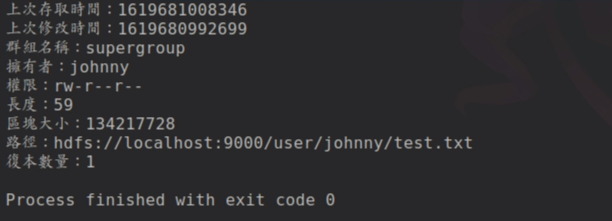
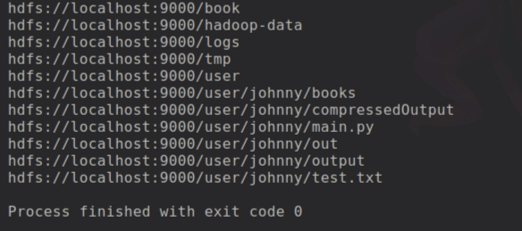

# 檔案詮釋資料： FileStatus

<br>

---

<br>

`FIleSystem` 類別的 `getFileStatus()` 方法，可以取得單一檔案或目錄的 `FileStatus` 物件。

<br>

使用範例：

<br>

```java
public class FileStatusTest {

        public static void main(String[] args) throws IOException {

                String filePath = "hdfs://localhost:9000/user/johnny/test.txt";

                Configuration conf = new Configuration();
                FileSystem fs = FileSystem.get(URI.create(filePath), conf);

                FileStatus status = fs.getFileStatus(new Path(filePath));

                System.out.println("上次存取時間：" + status.getAccessTime());
                System.out.println("上次修改時間：" + status.getModificationTime());
                System.out.println("群組名稱：" + status.getGroup());
                System.out.println("擁有者：" + status.getOwner());
                System.out.println("權限：" + status.getPermission());
                System.out.println("長度：" + status.getLen());
                System.out.println("區塊大小：" + status.getBlockSize());
                System.out.println("路徑：" + status.getPath());
                System.out.println("復本數量：" + status.getReplication());

        }

}
```



<br>
<br>
<br>
<br>

列出目錄下的檔案可以使用 `listStatus()` 方法。

<br>

```java
public FileStatus[] listStatus(Path f) throws IOException;

public FileStatus[] listStatus(Path f, PathFilter filter) throws IOException;

public FileStatus[] listStatus(Path[] files) throws IOException;

public FileStatus[] listStatus(Path[] files, PathFilter filter) throws IOException;
```

<br>

當參數是一個檔案時，回傳 FileStatus 物件陣列長度為 `1`。當參數是一個目錄時，他會回傳 `0` 或者多個 FileStatus 物件，這取決於目錄下的檔案數量。

<br>

`PathFilter` 可以過濾篩選出符合規則的檔案或目錄。如果想使用 Regex 的話可以自己做一個類別：

<br>

```java
public class RegexExcludePathFilter implements PathFilter {
    
        private final String regex;

        public RegexExcludePathFilter(String regex){
                this.regex = regex;
        }

        public boolean accept(Path path){
                return path.toString().matches(regex);
        }
}
```

<br>
<br>
<br>
<br>

接下來示範一個將路徑下的檔案列出的範例，借助 `FileUtil` 類別的 `stat2Paths()` 方法將 `FileStatus` 物件陣列轉成 `Path` 物件陣列。

<br>

```java
public class ListStatus {

        public static void main(String[] args) throws IOException {
                String uri = "hdfs://localhost:9000/";

                Configuration conf = new Configuration();
                FileSystem fs = FileSystem.get(URI.create(uri), conf);
                Path[] paths = new Path[2];

                paths[0] = new Path("hdfs://localhost:9000/");
                paths[1] = new Path("hdfs://localhost:9000/user/johnny");

                FileStatus[] status = fs.listStatus(paths);
                Path[] listedPaths = FileUtil.stat2Paths(status);

                for (Path path: listedPaths){
                    System.out.println(path);
                }
        }

}
```

<br>



<br>
<br>
<br>
<br>

