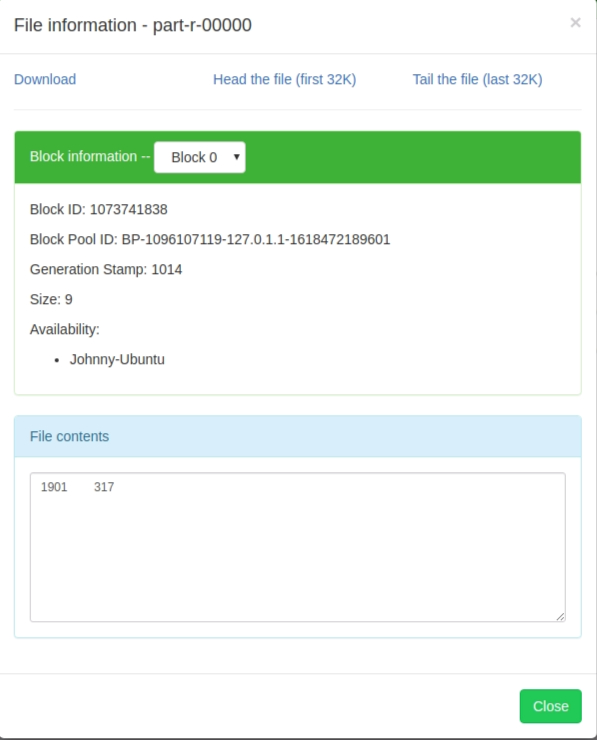

# 第二章 MapReduce 遇到的問題 (p22)

<br>

---

<br>

## 資料

<br>

這一個章節提到要使用的氣象站資料在這邊[下載](./data/1901)。

<br>

## Code

<br>

書中使用 Hadoop 的 lib 但也沒有特別說明來源於哪個 Jar 檔，所以我就去 maven 倉庫找了一些 Hadoop 的 lib 來試試，順便一提，我是使用 maven 來寫的這個 demo。pom 依賴如下：

<br>

```xml
<dependency>
            <groupId>org.apache.hadoop</groupId>
            <artifactId>hadoop-common</artifactId>
            <version>3.3.0</version>
        </dependency>

        <dependency>
            <groupId>org.apache.hadoop</groupId>
            <artifactId>hadoop-client</artifactId>
            <version>3.3.0</version>
        </dependency>


        <dependency>
            <groupId>org.apache.hadoop</groupId>
            <artifactId>hadoop-mapreduce-client-core</artifactId>
            <version>3.3.0</version>
        </dependency>

        <dependency>
            <groupId>org.apache.hadoop</groupId>
            <artifactId>hadoop-hdfs</artifactId>
            <version>3.3.0</version>
        </dependency>
```

<br>

我安裝使用的是 Hadoop 3.3.0 版本，所以這邊也都是用 3.3.0 的套件依賴。

<br>

由於最後我們還要將專案打包成 Jar 檔來讓 Hadoop 執行，所以要設定一下編譯設定：

<br>

```xml
<plugin>
    <artifactId>maven-assembly-plugin</artifactId>
        <configuration>
            <archive>
                <manifest>
                    <mainClass>com.frizo.lib.hadoop.MaxTemperature</mainClass>
                </manifest>
            </archive>
            <descriptorRefs>
                 <descriptorRef>jar-with-dependencies</descriptorRef>
            </descriptorRefs>
        </configuration>
</plugin>
```

<br>

有了上面的設定，我們就可以使用指令 `mvn clean compile assembly:single` 來編譯專案了。整個 demo 範例我放在[這裡](./code/hadooplib)。

<br>
<br>

## 執行 Hadoop 遇到的問題

<br>

在我們編譯好 Jar 檔之後，會得到假設我們的 Jar 檔叫做 hadoop-example.jar（用上面提到的 mvn 指令編譯回得到一個 hadoop-example-jar-with-dependencies.jar 的檔案，名字改一下就好），接下來書中提到要先 export HADOOP_CLASSPATH：

<br>

```bash
export HADOOP_CLASSPATH=hadoop-example.jar
```

<br>

這樣一來 Hadoop 就可以找到我們的 jar 檔了。緊接著執行下面的指令：

<br>

```bash
hadoop MaxTemperature hadoop-data/1901 output
```

<br>

這個時候會出現 Class Not Found 的錯誤，原因是因為我們指定 class 要連 package 路徑一起帶上：

<br>

```bash
hadoop com.frizo.lib.hadoop.MaxTemperature hadoop-data/1901 output
```

<br>

這個時候又有新的錯誤告訴我們在 hdfs 中找不到 hadoop-data/1901。原來這個 input path 不可以是本機資料，而是要在 hdfs 中的資料，所以我們就把資料搬入 hdfs 中吧（假如 1901 檔案位置在本機的 `~/hadoop-data`）：

<br>

```bash
hdfs dfs -mkdir hadoop-data
hdfs dfs -put ~/hadoop-data/1901 /hadoop-data/
```
<br>

放入檔案後再次執行 MapReduce 指令，很不幸，這次又有新的錯誤了：

<br>

```bash
錯誤: 找不到或無法加載類別 org.apache.hadoop.mapreduce.v2.app.MRAppMaster
```

<br>

原因是我們還需要在 mapred-site.xml 文件中添加 mapreduce 所用到的 classpath：

<br>

編輯 hadoop目錄下的文件 `/etc/hadoop/mapred-site.xml`，在 `<configuration>` 標籤中添加如下內容：

<br>

```xml
<configuration>
    <property>
        <name>mapreduce.framework.name</name>
        <value>yarn</value>
    </property>


    <property>
	    <name>mapreduce.application.classpath</name>
    	<value>/usr/local/hadoop/share/hadoop/mapreduce/*, /usr/local/hadoop/share/hadoop/mapreduce/lib/*</value>
    </property>	    

</configuration>

```

<br>

因為我得 hadoop 目錄是安裝在 `/usr/local/hadoop` 下，所以我這邊的 value 是這樣填的，根據自己的安裝路徑做適當調整。

<br>

好了以上設定完成之後我們重啟一下 hadoop：

<br>

```bash
stop-dfs.sh
stop-yarn.sh

start-dfs.sh
start-yarn.sh
```

<br>

再次執行 MapReduce 指令，這次又又新的錯誤了

<br>

```bash
Name node is in safe mode
```

<br>

當看到這個錯誤，我們就去把 namenode 的 safe mode 解除：

<br>

```bash
hdfs dfsadmin -safemode leave
```

<br>

設定好後，再次運行 MapReduce 指令，這次就可以正常運行並得出結果了。我們可以從 HDFS 管理器中看到產出的檔案。

<br>



<br>

1901 年最高氣溫 31.7 度。