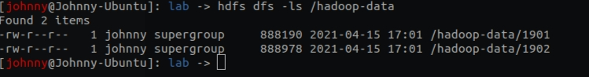
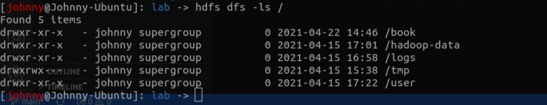

# 基本檔案系統操作(p51)

<br>

----

<br>

## 複製檔案到 HDFS

<br>

```bash
hdfs dfs -copyFromLocal ~/lab/test.txt hdfs://localhost:9000/user/johnny/test.txt
```

<br>

這個命令混將本地端 ~/lab/test.txt 複製到 localhost:9000 主機 HDFS 上的 /usr/johnny/test.txt 中。

<br>

事實上，我們可以省略 URL 格式和主機名稱，因為我們在 core-site.xml
 中已經有設定過預設值了(安裝教學部份已做過設定)：

<br>

 ```xml
<configuration>
        <property>
             <name>fs.defaultFS</name>
             <value>hdfs://localhost:9000</value>
        </property>
</configuration>
 ```

<br>

我們可以直接使用以下指令執行上面的 copy 命令：

```bash
hdfs dfs -copyFromLocal ~/lab/test.txt /user/johnny/test.txt
```

<br>

省略 `/user/johnny` 也可以，因為不指定絕對路徑的話預設就是複製到家目錄。

<br>

```bash
hdfs dfs -copyFromLocal ~/lab/test.txt test.txt
```

<br>
<br>
<br>
<br>

## 複製資料到本機

<br>

```bash
hdfs dfs -copyToLocal /user/johnny/test.txt ~/lab/test.copy.txt
```

<br>
<br>
<br>
<br>

## 建立目錄

<br>

```bash
hdfs dfs -mkdir /books
```

這個指令可以在跟目錄下建立 books 目錄。如果 books 目錄前沒有加 `/` 的話，則會在家目錄（`/user/johnny`）下建立此目錄。

<br>
<br>
<br>
<br>

## 查看目錄內容

<br>

查看跟目錄下內容：

```bash
hdfs dfs -ls /
```

<br>

查看家目錄下內容：

```bash
hdfs dfs -ls .
```

<br>

查詢一下先前實做 MaxTemperature 範例所使用的資料。

```bash
hdfs dfs -ls /hadoop-data
```

<br>

得到如下結果：



<br>

跟 Unix 指令 ls 很像，不過有一點不一樣，第二欄顯示的 `1` 是檔案的複本個數，我們在安裝教學部份設定復本個數為 `1` 所以這邊才會看到 `1`，這個復本個數的意思是這個檔案的 block 被複製了幾份分別存在不同 datanode 上。

<br>

第五欄會看到一組數字 1901 檔案的數字是 `888190`，這代表檔案大小，以 bytes 為單位。0 就代表是目錄。

<br>

我們再看一次根目錄：

```bash
hdfs dfs -ls /
```

<br>



<br>

首先看到第二欄的復本數量顯示為無（　`-`　），因為復本的概念沒有應用在目錄上，而且目錄並不會儲存在 datanode 中，而是在 namenode 中。檔案大小也都是 `0`。
