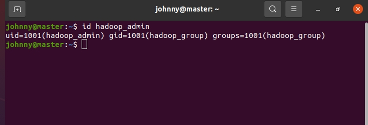
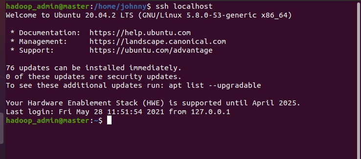
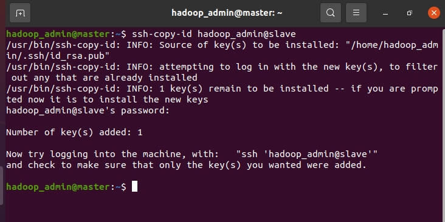
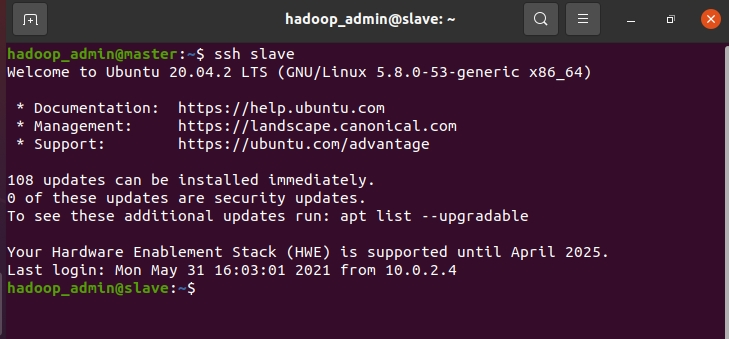
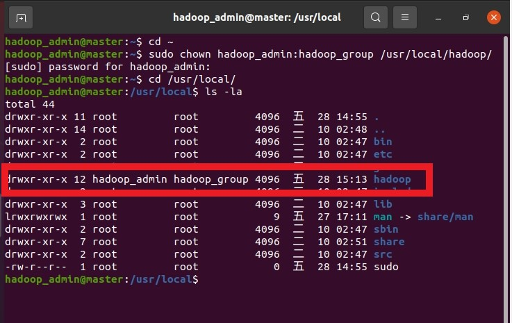
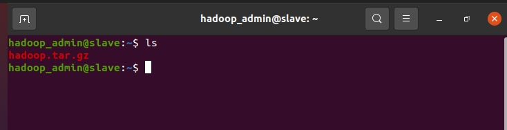
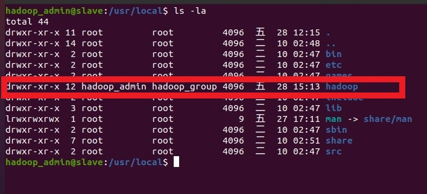
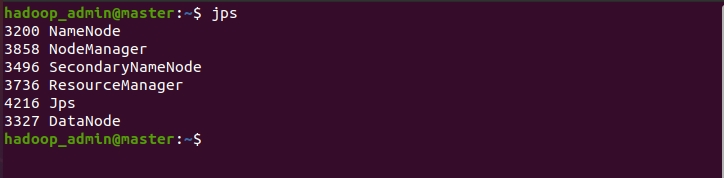
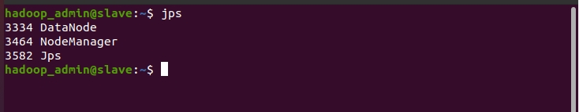
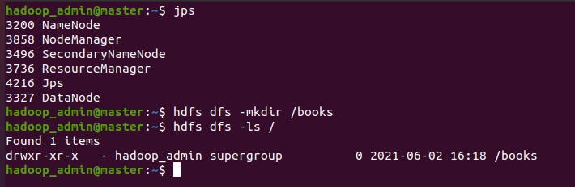

# Hadoop 分佈式安裝

<br>

-------------------

<br>
<br>

## JDK 安裝

<br>

hadoop 需要依賴 jre，我們使用 openjdk-1.8，在 Ubuntu 20.04 中可以直接使用 `apt` 指令安裝：

<br>

```
sudo apt-get update
sudo apt-get install openjdk-8-jdk
```

<br>
<br>
<br>
<br>

## 設定 hosts 以及 hostname

<br>

### 修改 `/etc/hosts`

<br>

分別修該兩台 VM 的 `/etc/hosts` 檔案，加入如下內容：

<br>

```
10.0.2.4 master
10.0.2.5 slave
```

<br>

---

__踩坑提醒!__，在編輯 /etc/hosts 的時候，記得要把 `127.0.0.1 master` 刪掉，不可以同時存在一個 hostname 對應 2 個 IP 的情況。同理，`127.0.0.1 slave` 也要刪除。

-------

<br>

當然，根據自己當前建立的網路環境進行 IP 調整，不一定要跟我寫的一樣。 hostname 請避免使用英數字以外文字，否則會影響 hadoop 的功能。

<br>
<br>

### 修改 `/etc/hostname`

<br>

因為建立虛擬機的時候，你可能並不一定使用了 master 或 slave 作為 VM 名稱，所以一樣修改 `/etc/hostname` 來確保 VM 名稱。

<br>
<br>
<br>
<br>

## 建立 hadoop 帳戶與相關設定

<br>

以下的帳戶建立操作要在 master 與 slave 兩台 VM 上同時進行。

<br>

建立 hadoop 專用群組

```
sudo addgroup hadoop_group
```

<br>

建立 Hadoop 專用帳戶

```bash
sudo adduser --ingroup hadoop_group hadoop_admin
```

過程中會要求輸入使用者密碼，除了密碼設定外，其他都直接 enter 鍵跳過。

<br>

建立好帳戶後，可以使用 `id hadoop_admin` 指令來檢查。

<br>



<br>

為了方便待會我們切換 hadoop_admin 帳戶之後的一些設定操作，我們先把 hadoop_admin 加入 sudo 權限。首先把 `/etc/sudoers` 文件的讀寫權限修改一下：

```bash
sudo chmod 700 /etc/sudoers
```

<br>

這樣我們就可以編輯 sudoers 檔案了，使用 `sudo vim /etc/sudoers` 編輯，再任意位置加入下面的設定：

<br>

```bash
hadoop_admin ALL=(ALL:ALL) ALL
```

<br>
<br>
<br>
<br>

## 設定 SSH 免密碼登入

<br>

由於資源管理需要調用 workers 們的資源，所以需要使用到 ssh 免密碼登入其他 node。這裡我們就來設定一下吧。

<br>

__以下步驟只需要在 master 上做既可，首先要切換到 hadoop_admin 帳戶__：

<br>

```bash
su hadoop_admin
```

<br>

安裝一下 openssh-server 服務：

```bash
apt-get install openssh-server
```

<br>

建立 RSA 密鑰

<br>

```bash
ssh-keygen -t rsa -P ""
```

<br>

一路按下 enter 就可以了。公鑰私鑰建立好後會預設放在 `~/.ssh` 資料夾，如果此時查看應該會看到兩份檔案：

<br>

* 私鑰檔案: `id_rsa`
* 公鑰檔案: `id_rsa.pub`

<br>

我們需要建立一個 `authorized_keys` 檔案並把公鑰內容複製到裡面。這樣就可以使用私鑰免輸入密碼直接登入本機。

<br>

```bash
cat /home/hadoop_admin/.ssh/id_rsa.pub >> /home/hadoop_admin/.ssh/authorized_keys
```

<br>

設定好後，來測試看看 ssh 本機:

```bash
ssh localhost
```

<br>

第一次 ssh 的時候會有詢問，需要輸入一次 `yes`，看到以下畫面就成功了：

<br>



<br>

接下來使用 `ssh-copy-id` 把 authorized_keys 共享給 slave 機器。

<br>

```bash
ssh-copy-id hadoop_admin@slave
```

<br>



<br>

過程中需要輸入 slave 機器的 hadoop_admin 帳戶密碼。

以上動作完成後，在 slave 機器的 `/home/hadoop_admin/.ssh/` 資料夾下會看到 authorized_keys 文件，這個文件就是來自於 master 的公鑰，其實這個步驟手動把 master 的 authorized_keys 複製到 slave 也是可以的。

接下來就可以測試 `ssh slave` 了，回到 master 測試 ssh 連線：

<br>



<br>

__測試成功後記得要 `exit` 離開 slave，因為接下來的動作要在 master 進行。__


<br>
<br>
<br>
<br>


## Hadoop 下載與安裝

<br>

__我們接下來的下載安裝動作只需要在 master 上操作， slave 先不要動作，記得我們的所有動作都是在 hadoop_admin 帳戶下進行的__。

<br>

下載 Hadoop-3.3.0：

<br>

```bash
cd ~

wget https://downloads.apache.org/hadoop/common/hadoop-3.3.0/hadoop-3.3.0.tar.gz 
```

<br>

隨著 Hadoop 版本推進，這個 url 可能會失效，不過道理都一樣，找到新版替換就可以。

<br>

解壓縮 hadoop-3.3.0.tar.gz，並重新命名為 hadoop 放置於 /usr/local：

<br>

```bash
tar -xvzf hadoop-3.3.0.tar.gz 
mv hadoop-3.3.0 /usr/local/hadoop 
```

<br>

更改 hadoop 的擁有者以及群組：

<br>

```bash
sudo chown hadoop_admin:hadoop_group /usr/local/hadoop/
```

<br>



<br>

設定 `.bashrc` 文件：

<br>

```bash
vim ~/.bashrc
```

<br>

添加內容如下：

<br>

```bash
...

# java config
export JAVA_HOME=/usr/lib/jvm/java-1.8.0-openjdk-amd64
export JRE_HOME=${JAVA_HOME}/jre
export CLASSPATH=.:${JAVA_HOME}/lib:${JRE_HOME}/lib
export PATH=${JAVA_HOME}/bin:$PATH

# hadoop config
export HADOOP_HOME=/usr/local/hadoop
export HADOOP_INSTALL=$HADOOP_HOME
export HADOOP_MAPRED_HOME=$HADOOP_HOME
export HADOOP_COMMON_HOME=$HADOOP_HOME
export HADOOP_HDFS_HOME=$HADOOP_HOME
export HADOOP_YARN_HOME=$HADOOP_HOME
export CLASSPATH=$($HADOOP_HOME/bin/hadoop classpath):$CLASSPATH
export HADOOP_COMMON_LIB_NATIVE_DIR=$HADOOP_HOME/lib/native
export PATH=$PATH:$HADOOP_HOME/bin:$HADOOP_HOME/sbin
export HADOOP_OPTS="-Djava.library.path=$HADOOP_HOME/lib/native"
```

<br>

編輯好後使用 `source` 指令套用環境變數設定：

<br>

```bash
source ~/.bashrc
```

<br>

最後還需要設定一下 `hadoop-env.sh` 文件：

<br>

```bash
vim $HADOOP_HOME/etc/hadoop/hadoop-env.sh
```

<br>

添加以下內容：

<br>

```bash
export JAVA_HOME=/usr/lib/jvm/java-1.8.0-openjdk-amd64
```

<br>
<br>
<br>
<br>

## conf 檔的相關設定

<br>

### 編輯 core-site.xml：

<br>

```bash
vim $HADOOP_HOME/etc/hadoop/core-site.xml
```

<br>

內容：

<br>

```xml
<configuration>
        <property>
                <name>fs.defaultFS</name>
                <value>hdfs://master:9000</value>
        </property>
        <property>
                <name>hadoop.tmp.dir</name>
                <value>file:/usr/local/hadoop/tmp</value>
        </property>
</configuration>
```

<br>

tmp 資料夾是不存在的，所以我們手動建立這個資料夾：

<br>

```bash
mkidr /usr/local/hadoop/tmp
```

<br>
<br>

### 編輯 hdfs-site.xml：

<br>

```bash
vim $HADOOP_HOME/etc/hadoop/hdfs-site.xml
```

<br>

內容：

<br>

```xml
<configuration>
        <property>
                <name>dfs.namenode.secondary.http-address</name>
                <value>master:50090</value>
        </property>
        <property>
                <name>dfs.namenode.name.dir</name>
                <value>file:/usr/local/hadoop/tmp/dfs/name</value>
        </property>
        <property>
                <name>dfs.datanode.data.dir</name>
                <value>file:/usr/local/hadoop/tmp/dfs/data</value>
        </property>
        <property>
                <name>dfs.replication</name>
                <value>2</value>
        </property>
</configuration>
```

<br>

在這一步驟，我們配置了 secondary namenode，還有 namenode datanode 存放位置，由於 tmp 資料夾下沒有任何內容，所以我們需要手動建立：

<br>

```bash
mkdir -p /usr/local/hadoop/tmp/dfs/name
mkdir -p /usr/local/hadoop/tmp/dfs/data
```

<br>


因為我們一共只有 2 個 datanode，所以我們的 replication 數量就設定為 2，這樣資料副本數量就會分別存放在兩台 vm 上。

<br>
<br>

### 編輯 mapred-site.xml：

<br>

```bash
vim $HADOOP_HOME/etc/hadoop/mapred-site.xml
```

<br>

內容：

<br>

```xml
<configuration>
        <property>
                <name>mapreduce.framework.name</name>
                <value>yarn</value>
        </property>
        <property>
             <name>yarn.nodemanager.aux-services</name>
             <value>mapreduce_shuffle</value>
        </property>
        <property>
            <name>mapreduce.jobhistory.address</name>
            <value>master:10020</value>
        </property>
        <property>
            <name>mapreduce.jobhistory.webapp.address</name>
            <value>master:19888</value>
        </property>
</configuration>
```

<br>
<br>

### 編輯 yarn-site.xml：

<br>

```bash
vim $HADOOP_HOME/etc/hadoop/yarn-site.xml
```

<br>

內容：

<br>

```xml
<configuration>
<!-- Site specific YARN configuration properties -->
        <property>
                <name>yarn.resourcemanager.hostname</name>
                <value>master</value>
        </property>
        <property>
                <name>yarn.nodemanager.aux-services</name>
                <value>mapreduce_shuffle</value>
        </property>
        <property>
                 <name>yarn.resourcemanager.webapp.address</name>
                 <value>master:8088</value>
         </property>
         <property>
                 <name>yarn.resourcemanager.scheduler.address</name>
                 <value>master:8030</value>
         </property>
         <property>
                 <name>yarn.resourcemanager.address</name>
                 <value>master:8032</value>
         </property>
         <property>
                 <name>yarn.resourcemanager.resource-tracker.address</name>
                 <value>master:8031</value>
         </property>
         <property>
                 <name>yarn.resourcemanager.admin.address</name>
                 <value>master:8033</value>
         </property>
</configuration>
```

<br>
<br>

編輯 workers：

目前為止，我們的部屬環境為：

* master: namenode + datanode

* slave: datanode

<br>

我們需要編輯　workers 文件讓 hadoop 知道節點都有哪些：

<br>

```bash
vim $HADOOP_HOME/etc/hadoop/workers
```

<br>

刪除原本的 ~~localhost~~ 並添加以下內容：

<br>

```bash
master
slave
```

<br>

以上，我們就完成了 hadoop 分布式的所有設定。

<br>
<br>


## 複製到 slave

<br>

master 與 slave 兩台機器上的 hadoop 設定都是一樣的，所以我們可以把剛剛設定好的 hadoop 整包複製到 slave 上。不果在這之前，我們 slave 上是沒有 JDK 與 環境變數設定的，所以在這之前，請一樣為 slave 機器安裝 jdk 與設定 `.bashrc`，過程就不詳述了，上邊都有。

<br>
<br>

### SCP

<br>

再說明往下的步驟前要先解釋一下，其實也可以在兩台 VM 上做 2 次同樣的動作，也是可以完成的，但是考慮到如果要部屬更多台的時候還是只做一次然後複製比較方便。

<br>
<br>

我們這邊會在 master 上使用到 `scp` 指令來複製內容到 slave 上。在複製之前，我們先來打包一下 hadoop 到家目錄下，打包過程會需要一點時間，耐心等待。

<br>

```bash
tar -zcf ~/hadoop.tar.gz /usr/local/hadoop
```

<br>

使用 `scp` 複製到 slave。

<br>

```bash
scp ./hadoop.tar.gz slave:/home/hadoop_admin/hadoop/
```

<br>

完成後可以去 slave 上檢查一下:

<br>



<br>

解壓縮到 /usr/local 底下：

<br>

```bash
sudo tar -zxf hadoop.tar.gz -C /usr/local/
```

<br>

以上都沒問題的話，在最後檢查一下 hadoop 的所屬群組及擁有者。

<br>

```bsah
cd /usr/local

ls -la
```

<br>



<br>
<br>

以上我們就完成了所有設定，接下來就測試一下啟動並建立文件吧。

<br>
<br>
<br>
<br>

## 啟動測試

<br>

__我們啟動操作一定是要在 master 上執行。__

__我們啟動操作一定是要在 master 上執行。__

__我們啟動操作一定是要在 master 上執行。__


<br>


如果是第一次啟動的話，記得 format 一下 hdfs：

<br>

```bash
hdfs namenode -format
```

<br>

啟動 HDFS

```
start-all.sh
```

<br>

啟動成功後，可以使用 jps 檢查一下。

<br>

master：

<br>



<br>

slave 機器我們從始至終都沒有去動，但是它一樣會被 master 調用，啟動 DataNode 與 NodeManager。

<br>

slave：

<br>



<br>

建立 dir 並用 ls 查看：

<br>



<br>
<br>

以上就是全部內容。如果想要查看 node 資訊可以使用以下指令：

<br>

```bash
hdfs dfsadmin -report
```

<br>

```bash
-------------------------------------------------
Live datanodes (2):

Name: 10.0.2.4:9866 (master)
Hostname: master
Decommission Status : Normal
Configured Capacity: 22059794432 (20.54 GB)
DFS Used: 32768 (32 KB)
Non DFS Used: 9570484224 (8.91 GB)
DFS Remaining: 11345072128 (10.57 GB)
DFS Used%: 0.00%
DFS Remaining%: 51.43%
Configured Cache Capacity: 0 (0 B)
Cache Used: 0 (0 B)
Cache Remaining: 0 (0 B)
Cache Used%: 100.00%
Cache Remaining%: 0.00%
Xceivers: 1
Last contact: Wed Jun 02 16:59:11 CST 2021
Last Block Report: Wed Jun 02 16:57:57 CST 2021
Num of Blocks: 0


Name: 10.0.2.5:9866 (slave)
Hostname: slave
Decommission Status : Normal
Configured Capacity: 22059794432 (20.54 GB)
DFS Used: 24576 (24 KB)
Non DFS Used: 9884467200 (9.21 GB)
DFS Remaining: 11031097344 (10.27 GB)
DFS Used%: 0.00%
DFS Remaining%: 50.01%
Configured Cache Capacity: 0 (0 B)
Cache Used: 0 (0 B)
Cache Remaining: 0 (0 B)
Cache Used%: 100.00%
Cache Remaining%: 0.00%
Xceivers: 1
Last contact: Wed Jun 02 16:59:12 CST 2021
Last Block Report: Wed Jun 02 16:57:51 CST 2021
Num of Blocks: 0

```