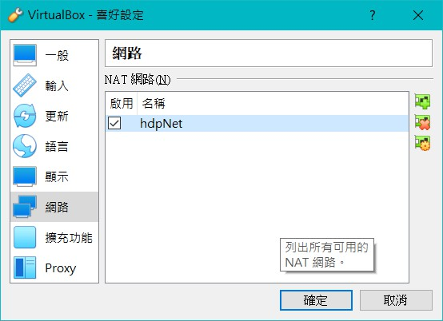
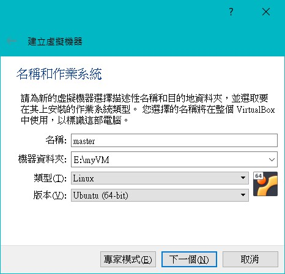
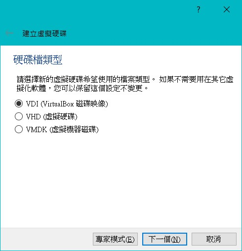
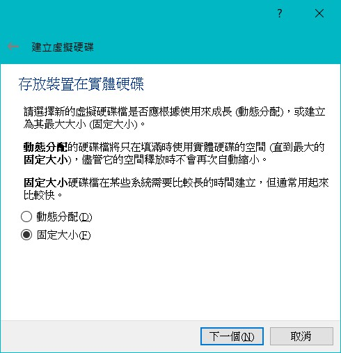
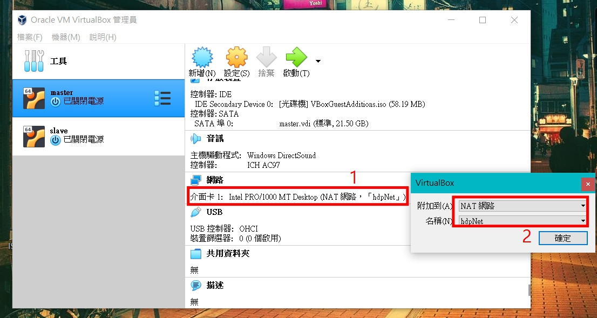
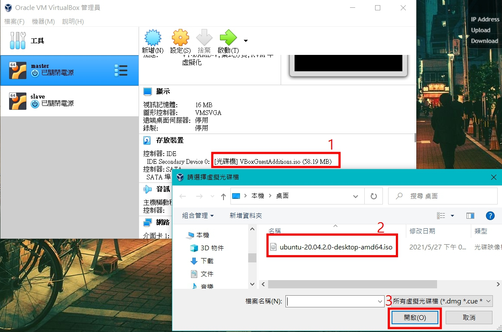
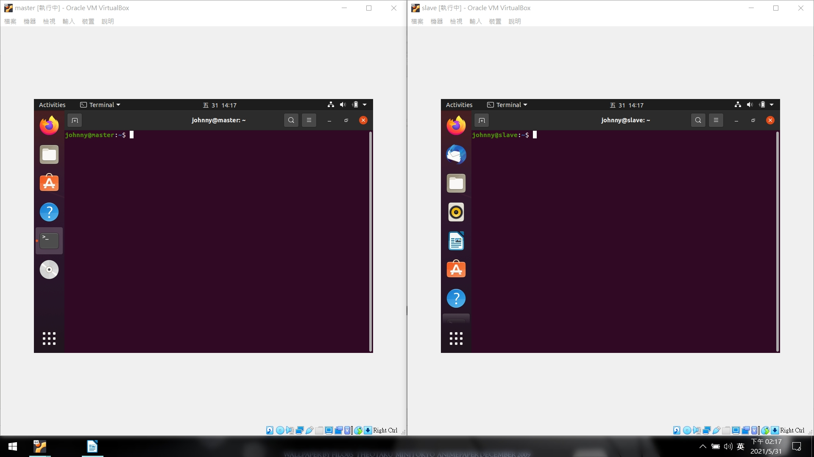
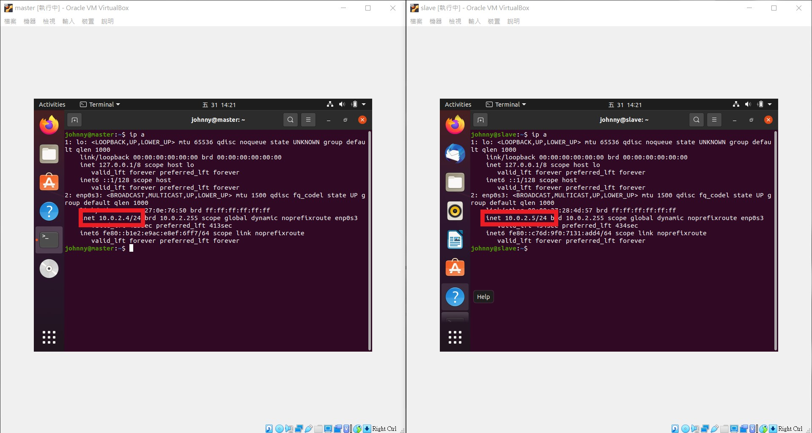

# 虛擬機安裝

 

---

 
 

## 環境

 

虛擬機軟體: VirtualBox 6.1.22

ISO : Ubuntu 20.04.2

 

關於 Ubuntu iso 檔的載點可以參考（請下載桌面版本，方便操作）:

https://www.ubuntu-tw.org/modules/tinyd0/

 
 
 
 

## NAT 網路

 

一切就緒後，我們首先要建立一個虛擬網路。

打開 VirtualBox > 檔案 > 喜好設定 > 網路 > 加入新的 NAT 網路

把這個新的 NAT 網路改名為 hdpNet。

 

 
 
 
 

## 建立虛擬機

 

按下新增建立虛擬機器 :

 

記憶體大小建議 4G 以上，hadoop 比較吃資源一點。

 

由於是示範，所以硬碟就取 20GB，不可以小於 15GB。

 

 

 

 

最後按下建立就可以了。

__以上步驟操作 2 次，建立一個 master 一個 slave，共 2 個虛擬機。__

 

 

接下來首先要設定一下網路卡的部分

master 跟 slave 2 台都要進行設定。

 

最後要設定開機讀取的 iso 檔:

 

以上都完成後直接開機，按照引導模式安裝就可以了。過程分常簡單就不多做介紹。

安裝完成後，分別重新開機。

 

 

最後要做的就是確認 NAT 是否正確建立，分別使用 `ip a` 指令檢查虛擬機的 IP。

 

 

可以看到兩台虛擬機的 IP 分別是:

* master : `10.0.2.4`

* slave  : `10.0.2.5`

 

每個人設定出來的 IP 都有可能不一樣，主要是兩台機器可以互相 ping 到就可以了。

 
 
 
 

以上就是虛擬機設定部分。

 
 
 
 

[下一篇: Hadoop 分佈式安裝 \> ](hadoop_install.md)