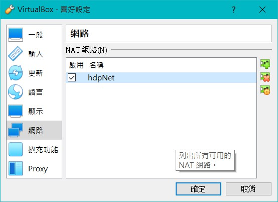
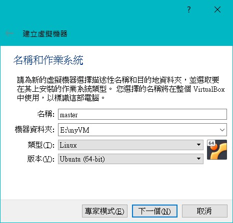
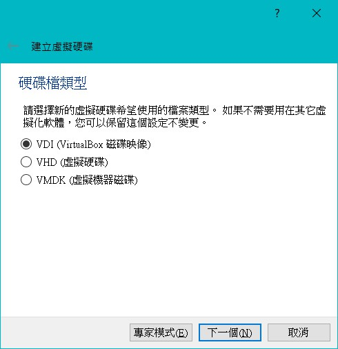
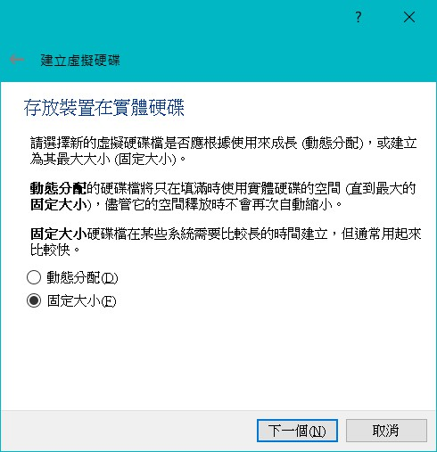

# Hadoop 分散式安裝

 

---

編寫日期 2021-05-28

 

本次 Hadoop 分散式安裝需要使用到 2 台 VM，不建議使用 GCE 來進行部屬，因為 GCE 由於安全性問題並不能很好的解決虛擬機之間免密碼使用 RSA 登入問題，所以這邊使用 VirtualBox 進行演示。

 
 
 
 

## 目錄

由於內容比較多，所以分成 2 個部分進行說明，第一部分為虛擬機安裝，第二部分為 Hadoop 安裝。

 

* [虛擬機安裝](#vm_install)

* Hadoop 安裝

 
 
 
 

## 虛擬機安裝 

__環境__：

* 虛擬機軟體: VirtualBox 6.1.22
* ISO : Ubuntu 20.04.2

 

關於 Ubuntu iso 檔的載點可以參考（請下載桌面版本，方便操作）:

https://www.ubuntu-tw.org/modules/tinyd0/

 

一切就緒後首先開始安裝 Ubuntu，在建立虛擬機之前，我們首先要建立一個虛擬網路

打開 VirtualBox > 檔案 > 喜好設定 > 網路 > 加入新的 NAT 網路

把這個新的 NAT 網路改名為 hdpNet。

 

 

接下來就可以開始建立虛擬機了

