# 設定 kerberos

<br>

---

<br>

參考文章：[Cloudera Manager CDH 集成 Kerberos -- 跟着大数据和AI去旅行 (2018-01-25)](https://blog.csdn.net/u011026329/article/details/79167884)

<br>

---


<br>

## cloudera quickstart VM 基本資訊

<br>

cloudera quickstart VM 裡預設有2組帳密可供使用：

<br>

* 一般 user 帳號: `cloudera`

  一般 user 密碼: `cloudera`

<br>

* 管理者帳號: `root`

  管理者密碼: `cloudera`

<br>
<br>
<br>
<br>

## 開啟 cloudera manager

<br>

先切換成 root 帳號，並來到 `/home/cloudera` 目錄下：

<br>

```
su root
cd /home/cloudera
```

<br>

啟動 cloudera manager：

<br>

```
./cloudera-manager --express
```

<br>

等待一段時間之後，當命令列提示啟動完成，我們就可以訪問 Cloudera Manager Web UI：

<br>

http://localhost:7180

<br>

初次訪問需要登入，這裡使用預設帳密，都是 `cloudera`：

<br>

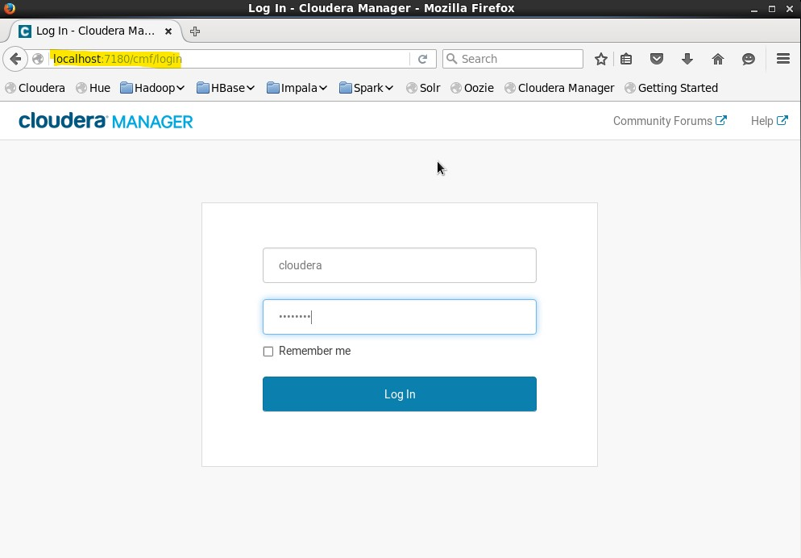

<br>

登入完成後，會看到如下畫面：

<br>

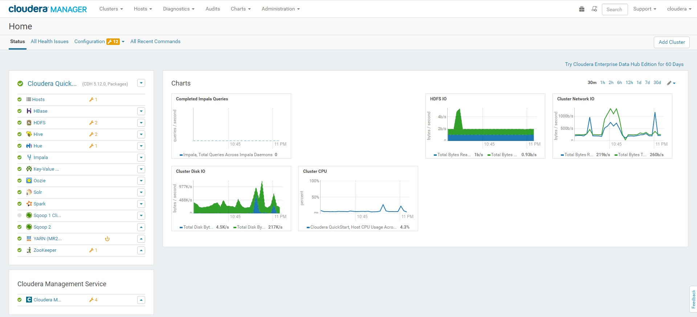

<br>

以上就正式完成 Cloudera Manager 的啟動了。

<br>
<br>
<br>
<br>

## 安裝 kerberos

<br>

Kerberos 分客戶端與伺服器端，出於實驗目的，這裡會把兩個都安裝在這台 VM 中。

<br>

伺服器端安裝：

<br>

```bash
yum -y install krb5-server openldap-clients 
```

<br>

客戶端安裝：

```bash
yum -y install krb5-devel krb5-workstation
```

<br>
<br>
<br>
<br>

## 修改 hosts

<br>

首先第一件事要做的就是修改 /etc/hosts：

<br>

```
vim /etc/hosts
```

<br>

添加內容如下：

<br>

```
127.0.0.1       kerberos.example.com
```

<br>

這個 domain name 之後會被大量使用到，所以我們先來做設定。

<br>
<br>
<br>
<br>

## 修改 krb5.conf

<br>

修改 /etc/krb5.conf，他包含 Kerberos 的配置資訊，如果使用的是分布式結構，需要在其他機器上同步這個文件內容。

<br>

```bash
[logging]
 default = FILE:/var/log/krb5libs.log
 kdc = FILE:/var/log/krb5kdc.log
 admin_server = FILE:/var/log/kadmind.log

[libdefaults]
 default_realm = EXAMPLE.COM
 dns_lookup_realm = false
 dns_lookup_kdc = false
 ticket_lifetime = 24h
 renew_lifetime = 7d
 forwardable = true
 rdns = false
 default_ccache_name = KEYRING:persistent:%{uid}

[realms]
  EXAMPLE.COM = {
   kdc = kerberos.example.com
   admin_server = kerberos.example.com
  }

[domain_realm]
  .example.com = EXAMPLE.COM
  example.com = EXAMPLE.COM
```

<br>

這邊的修改與原預設文件的差異在新增了 4 處：

<br>

[libdefaults] 部分：

```
rdns = false  # 反向解析
default_ccache_name = KEYRING:persistent:%{uid} # 憑據緩存名稱
```

<br>

[realms] 部分：

```
kdc = kerberos.example.com
admin_server = kerberos.example.com
```

<br>

這裡記住 kdc 與 admin_server 都設定成我們之前在 /etc/hosts 裡設定的域名，之後會用到。

<br>

default_realm 設定為 EXAMPLE.COM，這個 EXAMPLE.COM 並不代表是一個可被訪問的域名，他就是一個 realm，他也可以設定多個，注意必須是大寫。

<br>
<br>
<br>
<br>

## 修改 kdc.conf

<br>

編輯文件 /var/kerberos/krb5kdc/kdc.conf：

<br>

```
vim /var/kerberos/krb5kdc/kdc.conf
```

<br>

```
[kdcdefaults]
 kdc_ports = 88
 kdc_tcp_ports = 88

[realms]
 EXAMPLE.COM = {
  #master_key_type = aes256-cts
  acl_file = /var/kerberos/krb5kdc/kadm5.acl
  dict_file = /usr/share/dict/words
  admin_keytab = /var/kerberos/krb5kdc/kadm5.keytab
  supported_enctypes = aes128-cts:normal des3-hmac-sha1:normal arcfour-hmac:normal camellia256-cts:normal camellia128-cts:normal des-hmac-sha1:normal des-cbc-md5:normal des-cbc-crc:normal
  max_life = 25h
  max_renewable_life = 8d
 }
```

<br>

* `max_life` 與 `max_renewable_life` 這兩個參數必須妥善配置，否則會導致 ticket 無法更新造成無法補救的死循環。

* `supported_enctypes` 默認使用 `aes256-cts`，但是 java 使用 aes256 需要額外安裝 jar，所以我們把 aes256 刪掉。保留上述設定。

* `acl_file` 是用戶權限設定檔位置。

<br>
<br>
<br>
<br>

## 修改 kadm5.acl

<br>

編輯文件 /var/kerberos/krb5kdc/kadm5.acl：

<br>

```bash
vim /var/kerberos/krb5kdc/kadm5.acl
```

<br>

內容如下：

<br>

```bash
*/admin@EXAMPLE.COM     *
```

<br>

上一個設定中我們知道 kadm5.acl 文件是設定使用者權限的，解釋一下這個設定的意思，`*/admin` 代表登入時 `使用者名稱/admin@EXAMPLE.COM` 都是 admin 身分，最後面的 `*` 代表權限全開。

<br>
<br>
<br>
<br>

## 創建 kerberos DB

<br>

輸入指令：

<br>

```bash
kdb5_util create -r EXAMPLE.COM -s
```

<br>

這裡需要我們輸入密碼並做 2 次確認，為了方便就用 `kerberos` 當作密碼。

<br>

建立好後，可以在 `/var/kerberos/krb5kdc` 這個路徑下看到相關 principal 文件被建立出來。

<br>

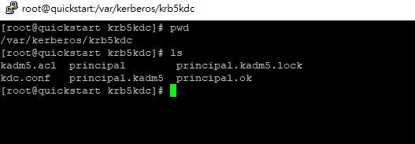

<br>

如果需要重新建立 DB，可以將該目錄下的 principal 文件都刪掉，重新來過即可。

<br>
<br>
<br>
<br>

## 啟動 kerberos

<br>

啟動：

```
service krb5kdc start
service kadmin start
```

<br>

加入開機啟動項：


```
service krb5kdc enable
service kadmin enable
```

<br>
<br>
<br>
<br>

## 創建 kerberos 管理員

<br>

建立兩組管理員帳號，需要分別輸入兩次新密碼。這邊的密碼都使用 `kerberos` 方便記憶。

<br>

```bash
kadmin.local -q "addprinc root/admin"
kadmin.local -q "addprinc cloudera-scm/admin"
```

<br>

之前在 `kadm5.acl` 我們設定了 `*/admin` 具有所有權限，所以添加的 root 與 cloudera-scm 都具有所有權限。

<br>

取得 `principal` 緩存：

<br>

```bash
kinit cloudera-scm/admin
```

<br>

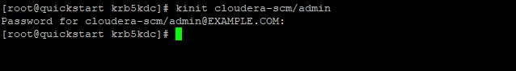

<br>

輸入 `klist` 指令檢查：

<br>

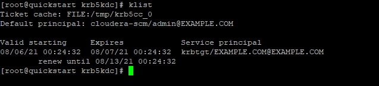

<br>

確認已經取得 ticket。

<br>
<br>
<br>
<br>

## Cloudera Manager 添加 Kerberos

<br>

啟動 Kerberos

<br>

進入 Cloudera-Manager Web UI，進入 Security 介面：

<br>

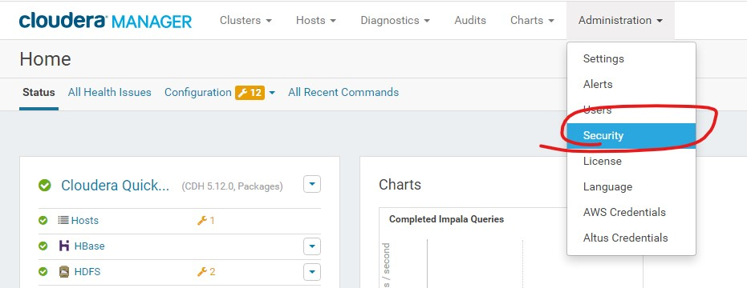

<br>

### 啟動 Kerberos：

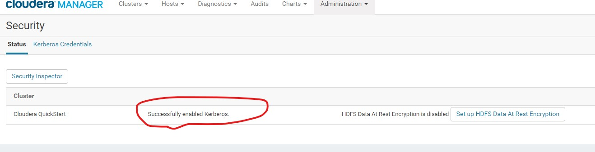

<br>

這邊因為我已經啟動過了，所以看不到啟動 kerberos 的按鈕，第一次啟動應該會出現一個 Enable Kerberos 的按鈕。

<br>

按下啟動 Kerberos 之後會進入一個 __一共 9 頁__ 的設定。像是這樣：

<br>

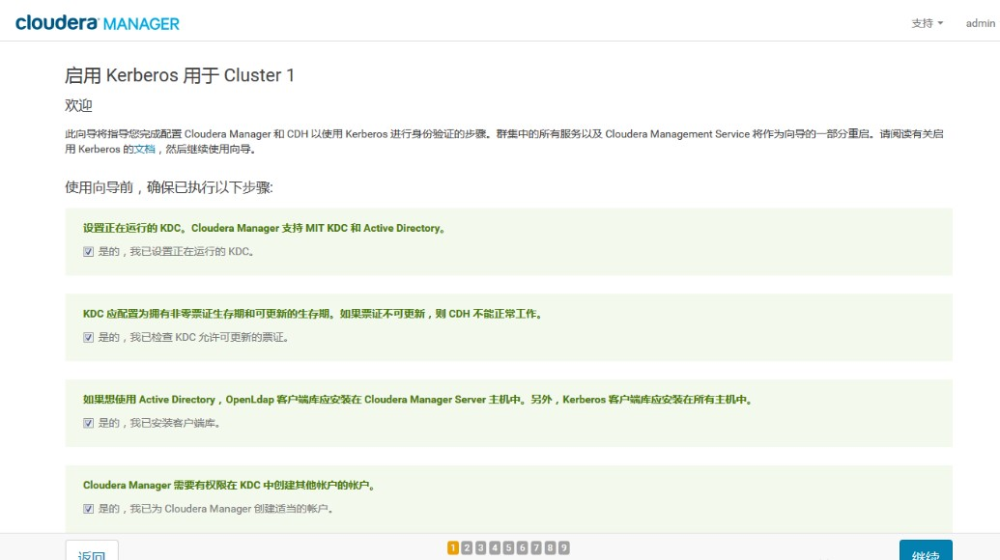

<br>

### KDC 資訊

<br>

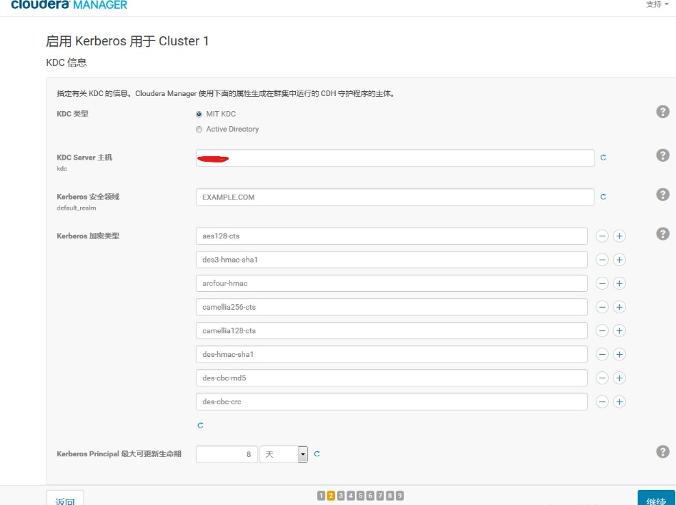

<br>

這裡會要求我們輸入 `KDC Server Host` 與 `KDC Admin Server Host`，還是得我們之前在 `krb5.conf` 設定的內容：

<br>

```
[realms]
  EXAMPLE.COM = {
   kdc = kerberos.example.com
   admin_server = kerberos.example.com
  }
```

<br>

所以這邊就都輸入 `kerberos.example.com`。

<br>

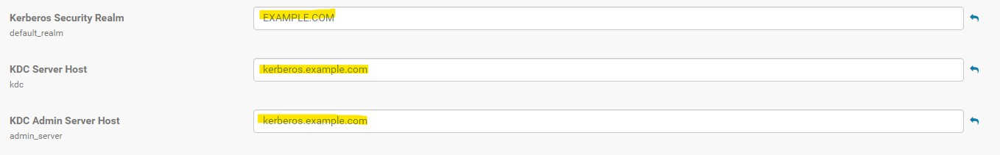

<br>

Kerberos Encryption Types 內容需要一個一個手動輸入，其內容就是 `kdc.conf` 文件中設定的 `supported_enctypes` 屬性：

<br>

```bash
supported_enctypes = aes128-cts:normal des3-hmac-sha1:normal arcfour-hmac:normal camellia256-cts:normal camellia128-cts:normal des-hmac-sha1:normal des-cbc-md5:normal des-cbc-crc:normal
```

<br>

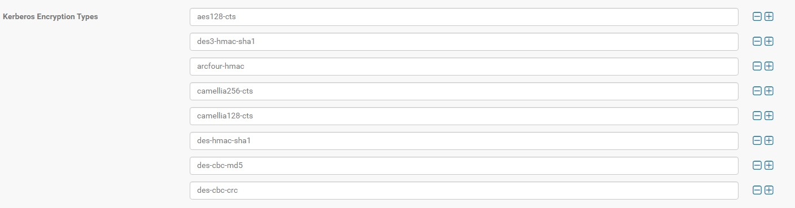

<br>

Maximum Renewable Life for Principals 設定 8 天：

<br>


<br>
<br>

### KDB5 

<br>

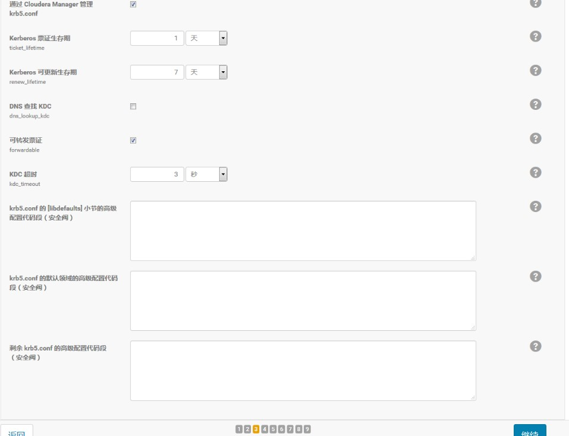

<br>
<br>

### KDC Account Manager

<br>

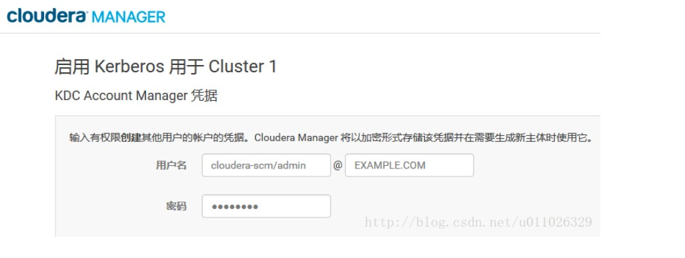

<br>

這邊的 account 就是先前註冊的管理者帳號。

<br>
<br>

### 導入 KDC Account Manager 憑證

<br>


<br>
<br>

### Kerberos Principals

<br>

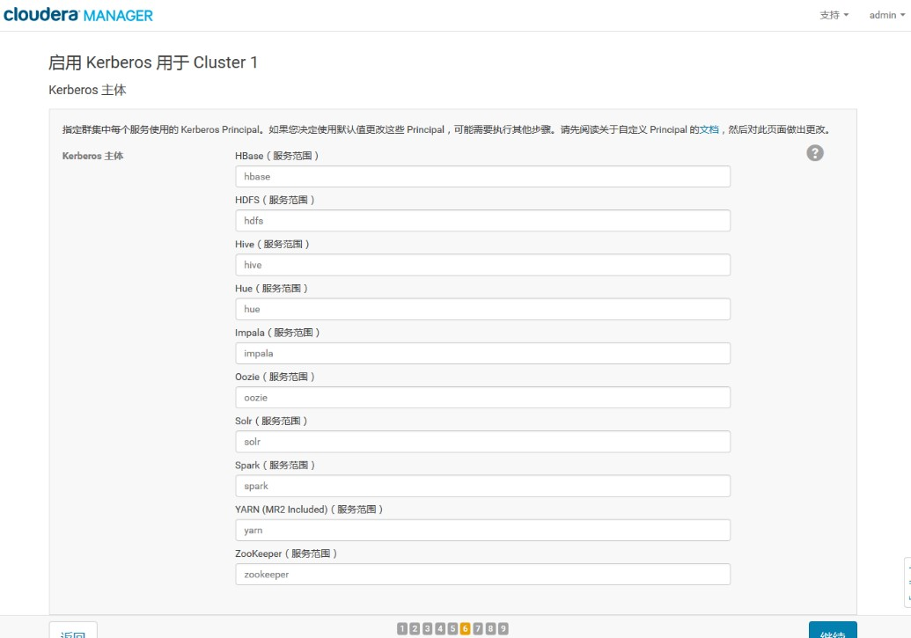


<br>
<br>

## Set HDFS Port

<br>

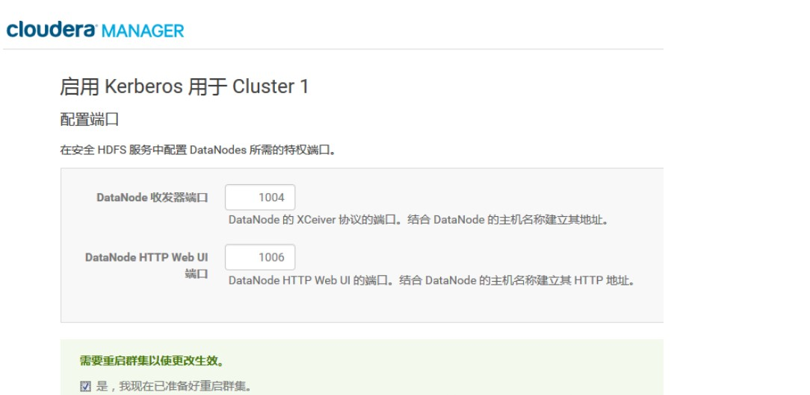

<br>
<br>

## restart service

<br>

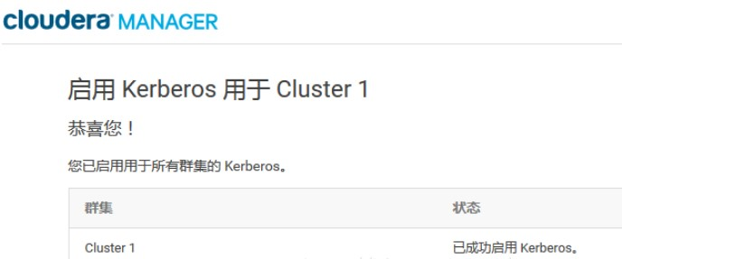

<br>
<br>
<br>
<br>

## 配置 HDFS Hbase Yarn

<br>

### HDFS 開啟 HTTP Web：

<br>

進入 HDFS 服務：

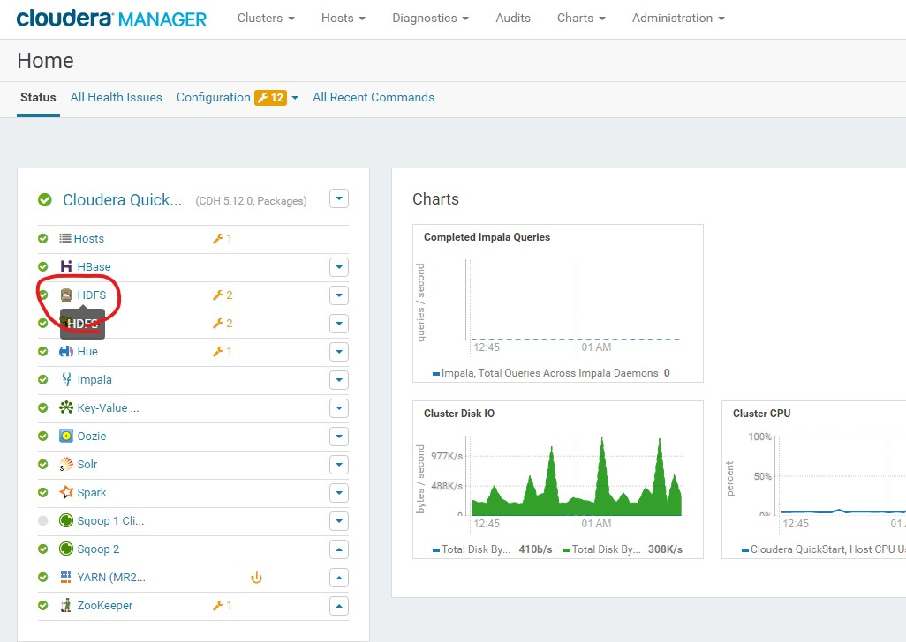

<br>

進入 config 面板：

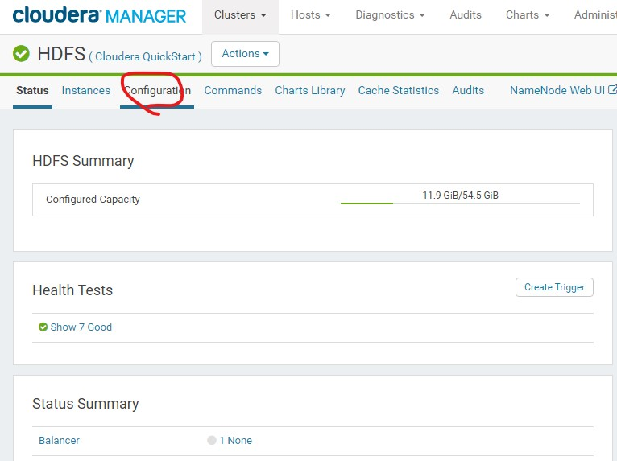

<br>

按照官方文件說明：

Expand Service-Wide > Security, check the Enable Authentication for HTTP Web-Consoles property, and save your changes.A command is triggered to generate the new required credentials.

<br>

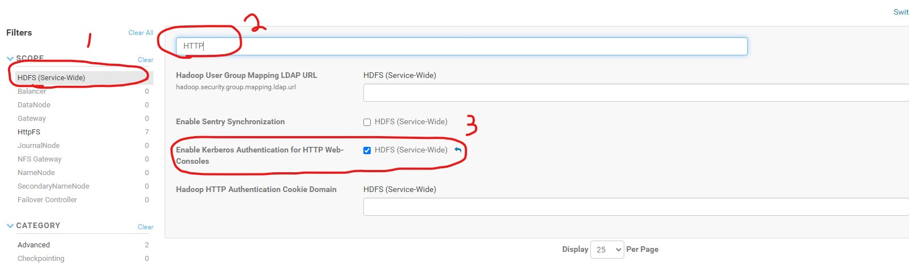

<br>

點 HDFS (Service-Wide)，搜尋 HTTP 勾選 Enable Kerberos Authentication for HTTP Web-Consoles 並保存。

<br>
<br>
<br>

### Yarn 開啟 HTTP Web:

<br>

進入 Yarn 服務：

<br>

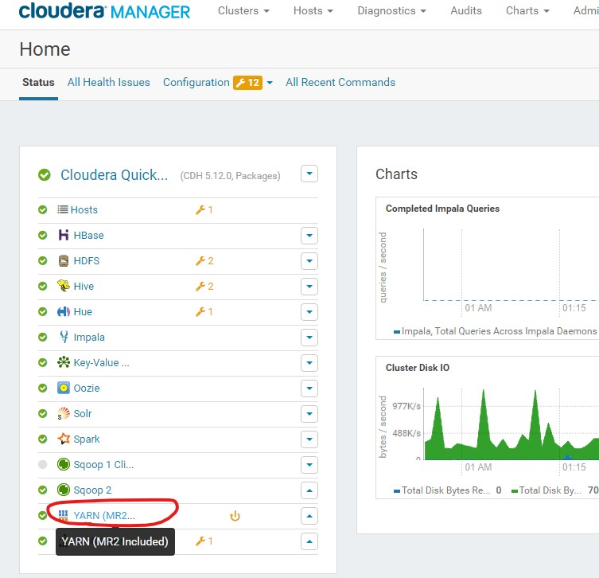

<br>

進入 config 面板：

<br>

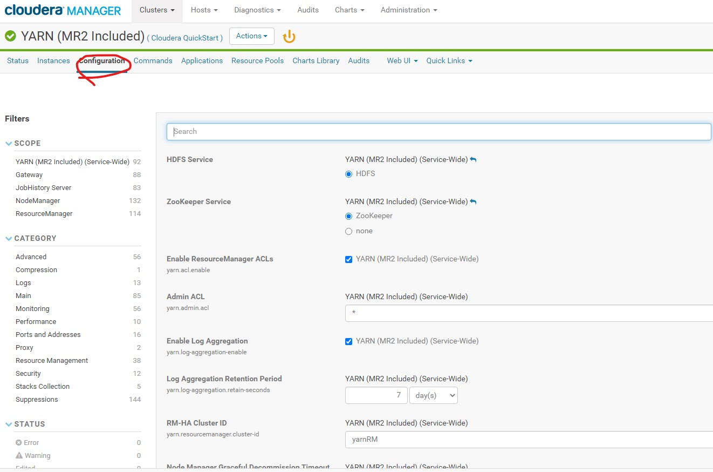

<br>

開啟 HTTP Web 服務：

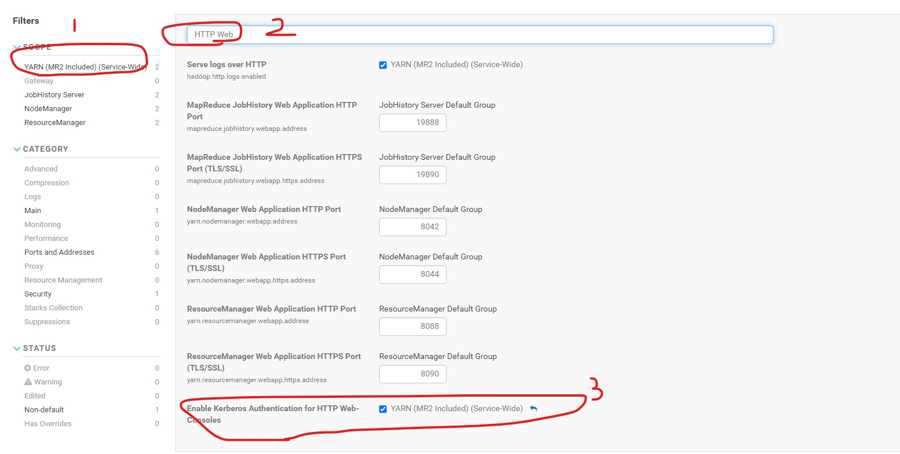

點選　YARN (MR2 Included) (Service-Wide)　搜尋 HTTP Web，點選 Enable Kerberos Authentication for HTTP Web-Consoles 並保存。

<br>
<br>

### HBase 開啟 REST 認證：

<br>

進入 Hbase 服務：

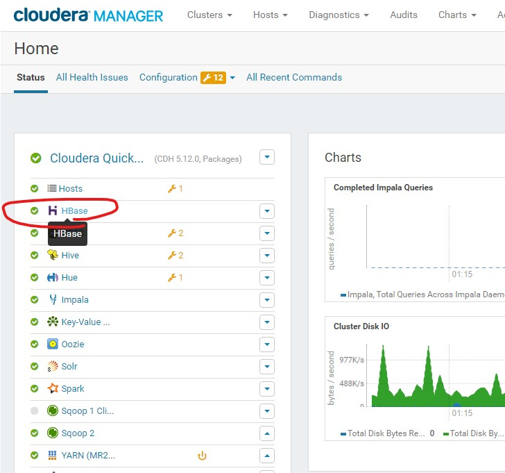

<br>

進入 config 面板：

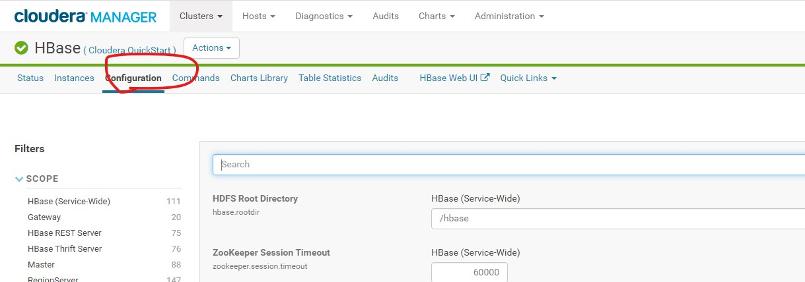

<br>

點選 HBase (Service-Wide) 搜尋 HBase REST Authentication 選取 kerberos 並保存：

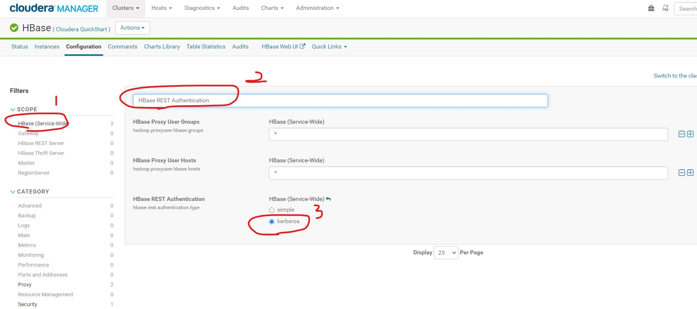

<br>

---

<br>

以上 3 個設定完成後要分別重啟服務：

<br>

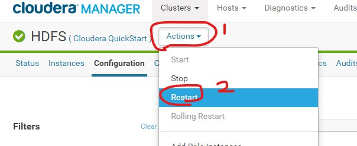

<br>

__HDFS Hbase Yarn 都要做一次。__

<br>

---

<br>
<br>
<br>
<br>

## 建立 HDFS Superuser

<br>

進入 HDFS 服務

<br>


<br>

進入 config 面板的 security 介面，並設定 superuser group：

<br>

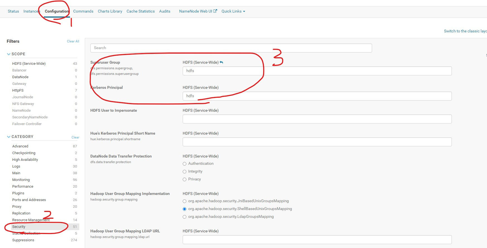

<br>

這邊我們設定為 `hdfs`。

<br>

完成後，我們需要建立 hdfs 帳號：

<br>

```bash
kadmin.local -q "addprinc hdfs"
```

<br>

取得 principal 緩存：

<br>

```bash
kinit hdfs
```

<br>

嘗試存取：

<br>

```bash
hdfs dfs -ls
```

<br>
<br>
<br>
<br>

## 為每一個服務建立 Kerberos Principal

<br>

```bash
kadmin.local -q "list_principals"
kadmin.local -q "addprinc hive"
kadmin.local -q "addprinc hbase"
kadmin.local -q "addprinc impala"
kadmin.local -q "addprinc spark"
kadmin.local -q "addprinc oozie"
kadmin.local -q "addprinc hue"
kadmin.local -q "addprinc yarn"
kadmin.local -q "addprinc zookeeper"
```

<br>
<br>
<br>
<br>

## 修改 user-id 限制

<br>

yarn 對 user-id 預設有一個限制，就是 user-id 必須大於 1000，不然無法正常提交 job。

我們建立的 hdfs 帳戶的 user-id 為 492：

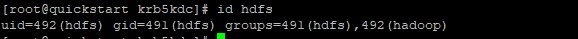

<br>

所以我們需要解除限制。

<br>

進入 yarn 服務點選 config 面板，搜尋 `user.id` 把 min User ID 改成 0。

<br>

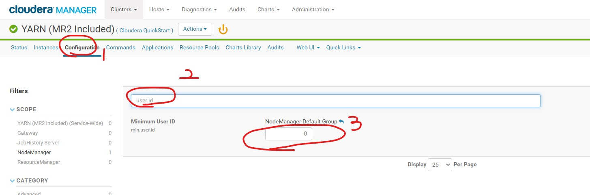

<br>
<br>
<br>
<br>

## 解除帳戶黑名單

<br>

yarn 預設會把一些帳戶名稱 ban 掉，我們需要把被誤 ban 的 user 解除。

<br>

進入 yarn 服務點選 config 面板，搜尋 `ban` 把 hdfs 帳戶解除掉。

<br>

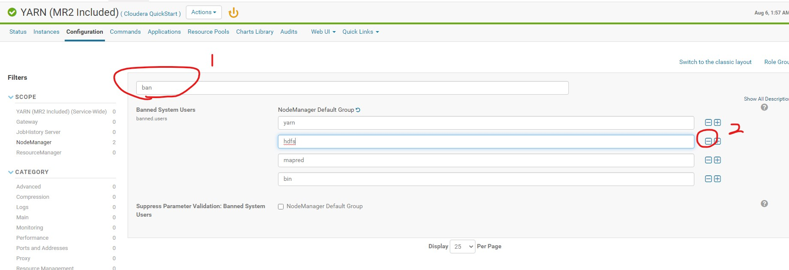

<br>
<br>
<br>
<br>

## 產生 keytab

<br>

Kerberos 客户端支持兩種驗證，一是 principal + Password，二是 principal + keytab，前者適用於指令交互，例如 `hadoop fs -ls`，後者使用於 java 應用。

principal + keytab 就類似於 ssh 免密碼登入。只需要保存好 keytab 就可以了。

<br>

添加 keytab：

<br>

```
kadmin.local -q "ktadd -k /home/cloudera hdfs@EXAMPLE.COM"
```

<br>

完成後，將會在 /home/cloudera 目錄下產生一個 hdfs.keytab 檔案。將這個檔案 copy 到其他機器上，就可以面密碼驗證了。

<br>

在 java 中測試：

<br>

```java
public static void main(String[] args) throws Exception {

    Configuration config = new Configuration();
    // 192.168.11.128 是 cloudera quickstart VM 的 IP
    hdfsurl = "hdfs://192.168.11.128:8020/";

    // hdfs.keytab 儲存在 D:\lib\ 下
    String keytab = "D:\\lib\\hdfs.keytab";
    String serverprincipal = "hdfs@EXAMPLE.COM";
    String userprincipal = "hdfs@EXAMPLE.COM";

    config.set("hadoop.security.authentication", "kerberos");
    config.set("hbase.master.kerberos.principal", serverprincipal);
    config.set("hbase.security.authentication", "kerberos");

    System.setProperty("java.security.krb5.realm", "EXAMPLE.COM");
    System.setProperty("java.security.krb5.kdc", "192.168.11.128");
    config.set("keytab", keytab);
    config.set("user principal", userprincipal);
    config.set("server principal", serverprincipal);

    config.set("dfs.namenode.kerberos.principal", serverprincipal);
    UserGroupInformation.setConfiguration(config);
    UserGroupInformation.loginUserFromKeytab(userprincipal, keytab);
    System.out.println(testHDFS(hdfsurl));

}


public static boolean testHDFS(String hdfsurl) throws IOException, URISyntaxException {
        FileSystem hdfs = null;
        try {
            config.set("fs.hdfs.impl", "org.apache.hadoop.hdfs.DistributedFileSystem");
            config.set("fs.defaultFS", hdfsurl);

            hdfs = FileSystem.get(new URI(hdfsurl), config);
            if (null != hdfs) {
                hdfs.exists(new Path("/"));
                hdfs.close();
                return true;
            }
        } catch (IOException | URISyntaxException e) {
            log.append("Error hdfsurl:" + hdfsurl);
            throw e;
        }
        return false;
    }
```

<br>

執行測試

<br>

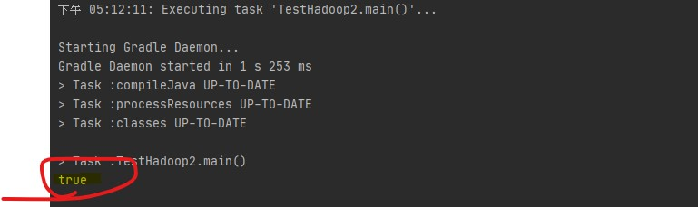


