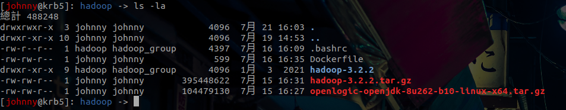
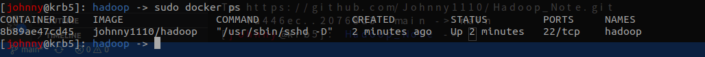
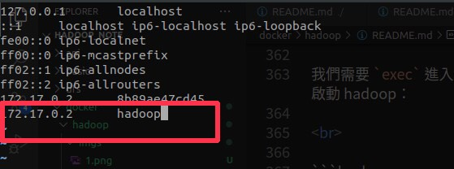
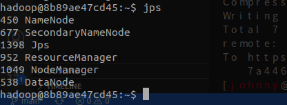

# 鏡像：hadoop

<br>

---

<br>

完成上一個 ubuntu-ssh 鏡像之後，接下來要做的事情是製作 hadoop 鏡像。

<br>

首先建立一個名為 hadoop 的目錄：

<br>

```bash
cd ~
mkdir hadoop
```

<br>

建立 Dockerfile

<br>

```bash
touch Dockerfile
```

<br>

在編寫 Dockerfile 之前，我們先準備好一些東西，他們分別是：

<br>

* openJDK-1.8

* hadoop-3.2.2

* .bashrc 文件

<br>

openjdk 跟 hadoop 都可以從網路上找到下載方式，應該都會是 tar.gz 檔。我們把上述提到的 3 樣東西先放入 hadoop 目錄中，.bashrc 檔案點 [這裡](bashrc) 獲取。

<br>

openJDK 不需要做內部 conf 設定所以我們就讓他保持 tar.gz 的狀態，而 hadoop 因為我們要做許多相關設定，所以我們先把他解壓縮：

<br>

```bash
tar -xvf hadoop-3.2.2.tar.gz 
```

目前目錄下應該長這樣：

<br>



<br>

接下來我們要針對 hadoop 的設定檔做一些 conf 設定。跟前面筆記中分佈式設定幾乎一樣，這邊我還是再重複一次。

<br>

## hadoop-env.sh

<br>

```
vim hadoop3.2.2/etc/hadoop/hadoop-env.sh
```

<br>

加入下面的設定

<br>

```bash
export JAVA_HOME=/usr/local/jdk1.8
```

<br>
<br>

## 編輯 core-site.xml：

<br>

```bash
vim hadoop3.2.2/etc/hadoop/core-site.xml
```

<br>

```xml
<configuration>
        <property>
                <name>fs.defaultFS</name>
                <value>hdfs://hadoop:9000</value>
        </property>
        <property>
                <name>hadoop.tmp.dir</name>
                <value>file:/usr/local/hadoop/tmp</value>
        </property>
</configuration>
```

<br>
<br>

## 編輯 hdfs-site.xml：

<br>

```bash
vim hadoop3.2.2/etc/hadoop/hdfs-site.xml
```

<br>

```xml
<configuration>
        <property>
                <name>dfs.namenode.secondary.http-address</name>
                <value>hadoop:50090</value>
        </property>
        <property>
                <name>dfs.namenode.name.dir</name>
                <value>file:/usr/local/hadoop/tmp/dfs/name</value>
        </property>
        <property>
                <name>dfs.datanode.data.dir</name>
                <value>file:/usr/local/hadoop/tmp/dfs/data</value>
        </property>
        <property>
                <name>dfs.replication</name>
                <value>1</value>
        </property>
</configuration>
```

<br>
<br>

## 編輯 mapred-site.xml：

<br>

```bash
vim hadoop3.2.2/etc/hadoop/mapred-site.xml
```

<br>

```xml
<configuration>
        <property>
                <name>mapreduce.framework.name</name>
                <value>yarn</value>
        </property>
        <property>
             <name>yarn.nodemanager.aux-services</name>
             <value>mapreduce_shuffle</value>
        </property>
        <property>
            <name>mapreduce.jobhistory.address</name>
            <value>hadoop:10020</value>
        </property>
        <property>
            <name>mapreduce.jobhistory.webapp.address</name>
            <value>hadoop:19888</value>
        </property>
</configuration>
```

<br>
<br>

## 編輯 yarn-site.xml：

<br>

```bash
vim hadoop3.2.2/etc/hadoop/yarn-site.xml
```

<br>

```xml
<configuration>
<!-- Site specific YARN configuration properties -->
        <property>
                <name>yarn.resourcemanager.hostname</name>
                <value>hadoop</value>
        </property>
        <property>
                <name>yarn.nodemanager.aux-services</name>
                <value>mapreduce_shuffle</value>
        </property>
        <property>
                 <name>yarn.resourcemanager.webapp.address</name>
                 <value>hadoop:8088</value>
         </property>
         <property>
                 <name>yarn.resourcemanager.scheduler.address</name>
                 <value>hadoop:8030</value>
         </property>
         <property>
                 <name>yarn.resourcemanager.address</name>
                 <value>hadoop:8032</value>
         </property>
         <property>
                 <name>yarn.resourcemanager.resource-tracker.address</name>
                 <value>hadoop:8031</value>
         </property>
         <property>
                 <name>yarn.resourcemanager.admin.address</name>
                 <value>hadoop:8033</value>
         </property>
</configuration>
```

<br>
<br>

## 編輯 worker

<br>

```bash
vim hadoop3.2.2/etc/hadoop/workers
```

<br>

```
hadoop
```

<br>
<br>

完成設定後，讓我們來看一下 Dockerfile 怎麼寫：

<br>

## 編寫 Dockerfile

<br>

```Dockerfile
# 1
FROM johnny1110/ubuntu-ssh

MAINTAINER Johnny

# 2
ADD openlogic-openjdk-8u262-b10-linux-x64.tar.gz /usr/local/
RUN mv /usr/local/openlogic-openjdk-8u262-b10-linux-64 /usr/local/jdk1.8

# 3
COPY ./hadoop-3.2.2 /usr/local/hadoop
RUN chown hadoop:hadoop_group /usr/local/hadoop

# 4
COPY ./.bashrc /home/hadoop/.bashrc
RUN chown hadoop:hadoop_group /home/hadoop/.bashrc

# 5
USER hadoop

WORKDIR /home/hadoop
RUN /bin/bash -c "source /home/hadoop/.bashrc"

RUN mkdir /usr/local/hadoop/tmp
RUN mkdir -p /usr/local/hadoop/tmp/dfs/name
RUN mkdir -p /usr/local/hadoop/tmp/dfs/data

# 6
USER root
CMD ["/usr/sbin/sshd", "-D"]
```

<br>
<br>

* `#1` 基底鏡像使用之前製作的 ubuntu-ssh

* `#2` 使用 `ADD` 指令可以自動解壓縮 jdk，完成  JDK 部份的安裝

* `#3` 使用 `COPY` 指令把我們提前設定好 conf 的 Hadoop 放入到指定位置，並修改擁有者權限為 hadoop 使用者。

* `#4` 把提前設定好的 .bashrc 環境變數複製到 hadoop 帳號家目錄下。

* `#5` 切換成 hadoop 帳戶，使用   `source` 指令套用 .bashrc 設定。最後建立起 hadoop 所需要的一些目錄。

* `#6` 切換回 root，執行 `sshd` 命令。

<br>
<br>

以上我們已經編寫好鏡像所需的所有需求了，接下來 build 起來就可以了。

<br>
<br>

## build 鏡像

<br>

`cd` 到 hadoop 目錄下，你會看到這樣的內容：

<br>


<br>

確認無誤後執行以下指令：

<br>

```bash
sudo docker build -t "這裡輸入你的docker帳號/hadoop" .
```

<br>

靜靜等待建構完成。


<br>
<br>

## 啟動容器

<br>

完成後可以啟動起來進行測試。

<br>

```bash
sudo docker run -d --name hadoop johnny1110/hadoop
```

<br>

這邊我的 docker 帳號是 johnny1110， 啟動後可以使用 `sudo docker ps` 檢查容器是否正常運行。  

<br>



<br>

我們需要 `exec` 進入到容器內部，對 /etc/hosts 做一下設定，並且試著啟動 hadoop：

<br>

```bash
sudo docker exec -it hadoop /bin/bash
```

<br>

進入容器後，第一步先編輯 /etc/hosts（沒有 vim 就自己 apt-get 一下）


<br>

```bash
vim /etc/hosts
```

<br>

加入內容：



<br>

實際根據自己當下容器的虛擬 IP 位置更改，hostname 使用 hadoop

<br>

最後我們就可以啟動 hadoop 了，先換帳號換成 hadoop

<br>

```bash
su hadoop
```

<br>

然後初始化 namenode：

<br>

```bash
hdfs namenode -format
```

<br>

啟動 dfs 與 yarn：

<br>

```
start-dfs.sh
start-yarn.sh
```

<br>

最後使用 `jps` 查看一下 java 進程：

<br>



<br>
<br>

完成！

<br>

-----

<br>

## Tips

<br>

如果你想在本機上使用 JAVA API 測試 Hadoop 的話，一樣要去改本機上的 /etc/hosts ，把 `172.17.0.2      hadoop` 加入進去。

<br>

Java 連線字串就是：`hdfs://hadoop:9000`