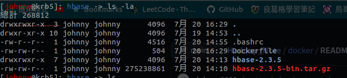

# 鏡像：Hbase

<br>

---

<br>

完成 Hadoop 鏡像之後，接下來製作 Hbase 鏡像，我們以 hadoop 為基底鏡像繼續編寫。

<br>

首先先建立目錄：

<br>

```bash
cd ~
mkdir hbase
```

<br>

建立 Dockerfile：

<br>

```bash
touch Dockerfile
```

<br>

在編寫 Dockerfile 以前，需要事先準備好 hbase 軟體放置在建構目錄內，為了搭配 hadoop3.2.2，這邊我選用的是 hbase-2.3.5。下載好後由於我們需要提前做 conf 設定，所以先解壓縮：

<br>

```bash
tar -xvf hbase-2.3.5-bin.tar.gz
```

除此之外，由於我們從 hadoop 基底上新增了 hbase，所以 .bashrc 也要增加 hbase 相關環境變數。新的 .bashrc 文件點 [這裡](.bashrc) 。

<br>

到目前為止，建構目錄下的內容應該是這樣的：

<br>



<br>

接下來，我們先來對 hbase 的 conf 做一些設定：

<br>
<br>
<br>
<br>


## 編輯 /conf/hbase-env.sh

<br>

加入以下設定：

<br>

```bash
export JAVA_HOME=/usr/local/jdk1.8
```

<br>
<br>

## 編輯 Dockerfile

<br>

```bash
vim Dockerfile
```

<br>

```Dockerfile
# 1
FROM johnny1110/hadoop

MAINTAINER Mikey

# 2
COPY ./hbase-2.3.5 /usr/local/hbase-2.3.5
RUN chown hadoop:hadoop_group /usr/local/hbase-2.3.5

# 3
RUN rm /home/hadoop/.bashrc
COPY ./.bashrc /home/hadoop/.bashrc
RUN chown hadoop:hadoop_group /home/hadoop/.bashrc

# 4
RUN mkdir -p /etc/tmp/zookeeper/zookeeper_0/version-2
RUN chown hadoop:hadoop_group /etc/tmp/zookeeper/zookeeper_0/version-2

# 5
USER hadoop
RUN /bin/bash -c "source /home/hadoop/.bashrc"

# 6
USER root
EXPOSE 2181
CMD ["/usr/sbin/sshd", "-D"]
```

<br>

* `#1` 使用 hadoop 作為基底鏡像

* `#2` 把提前設定好的 hbase `COPY` 到容器內的 /usr/local 目錄下

* `#3` 重新設定 .bashrc

* `#4` 建立 hbase 啟動所需 tmp 目錄

* `#5` 切換 hadoop 帳戶使用 `source` 命令載入 .bashrc 

* `#6` 切換 root 帳戶啟動 `sshd`


<br>
<br>

以上完成後，就可以開始 `build` 鏡像了。

<br>
<br>


## build 鏡像

<br>

```bash
sudo docker build -t "你的docker帳號/hbase" .
```

<br>

建構好後就啟動吧：

<br>

```bash
sudo docker run -d --name hadoop johnny1110/hbase  
```

<br>

這裡我為什麼要將容器命名為 hadoop 呢，是因為前面 hadoop 鏡像就已經設定過連線 hdfs 要用 hdfs://hadoop:9000 了，所以這邊的 hostname 一樣要保持使用 hadoop。

<br>

成功啟動容器之後，跟前一個鏡像 hadoop 一樣，要先改 /etc/hosts，然後切換成 hadoop 帳戶， namenode format 再來啟動 dfs 與 yarn。最後輪到啟動 hbase：

<br>

```bash
start-hbase.sh
```

```bash
hbase shell
```

<br>

成功啟動 hbase shell 之後，試著建立一個 table 試試：

<br>

```bash
create 'test', 'val'
```