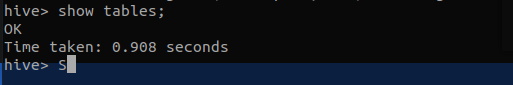

# 鏡像：hive (最終鏡像)

<br>

---

<br>

完成 hbase 鏡像製作後，我們就可以使用 hbase 來當作接下來 hive 的基底鏡像。因為這個鏡像製作完成後，就會包含 hadoop hbase hive，所以這個鏡像我取名叫做 hset，也就是最終版本鏡像。

<br>

首先先建立建構目錄：

<br>

```bash
cd ~
mkdir hive
```

<br>

建立 Dockerfile

<br>

```bash
touch Dockerfile
```

<br>

在這個工作目錄中我們需要放入新的 .bashrc 文件，文件取得點 [這裡](bashrc)

<br>

我們需要準備好 hive 軟體，這裡我選用的是： `apache-hive-3.1.2`。

<br>

下載好後就直接解壓縮，我們需要調整一下設定檔：

<br>

```bash
tar -xvf apache-hive-3.1.2-bin.tar.gz
```

<br>

 一切就緒後，目錄內容應該看到如下：

 <br>

 

 <br>

 接下來就來修改一下設定檔吧：

<br>
<br>

## 編輯 hive-config.sh

<br>

```bash
vim apache-hive3.1.2-bin/bin/hive-config.sh
```

<br>

加入 hadoop_home 環境變數：
 
 <br>

 ```bash
 export HADOOP_HOME=/usr/local/hadoop
 ```

 <br>
  <br>

 ## 替換 guava.jar

 <br>

 接下來要做一件事，hadoop 與 hive 使用到的 guava.jar 版本要一致，所以我們先把 hive 的 guava.jar 刪掉，然後去先前 hadoop 建構目錄把 guava.jar 複製到 hive 中，路徑是：

 <br>

 hive jar 檔位置：`apache-hive3.1.2-bin/lib`

hadoop jar 檔位置： `hadoop/share/hadoop/hdfs/lib`

<br>
<br>

## 設定 hive-site.xml

<br>

hive-site.xml 設定內容非常多，所以 hive 有幫我們準備一個預設模板，我們只需要改我們需要的位置就好了，首先我們先把預設模板複製一份：

<br>

```bash
cd apache-hive3.1.2-bin/conf
cp hive-default.xml.template hive-site.xml
```

<br>

修改 hive-site.xml 內容：

```bash
vim hive-site.xml
```

<br>

首先我們需要確認一下 hive.metastore.warehouse.dir 屬性的值，利用 vim 檢索指令跳行到指定位置：

<br>

```vim
:?hive.metastore.warehouse.dir
```

<br>

於是我們可以看到預設上如果是 `/user/hive/warehouse` 就對了：

<br>


<br>
<br>

設定 Metastore ConnectionURL：

<br>

```xml
<property>
    <name>javax.jdo.option.ConnectionURL</name>
    <value>jdbc:derby:/usr/local/apache-hive-3.1.2-bin/metastore_db;databaseName=metastore_db;create=true</value>
</property>
```

<br>

__除此之外，我們還需要刪掉 hive 3.1.2 版的一個 bug，大約在 3215 行附近有一個 <description> 區塊，我們直接刪掉，因為這個敘述區塊有一個非法字元會造成讀取問題。__

<br>

---

tips: vim 跳行方法就是直接輸入行數然後按住 shift + G。

---

<br>
<br>

最後還需要添加一下 iotmp 資料夾，不然執行階段還是會出錯。

在 hive-site.xml 修改以下屬性，一樣使用搜尋關鍵字的方式搜尋 property 的 name：

<br>

```xml
<property>
    <name>hive.exec.local.scratchdir</name>
    <value>/usr/local/apache-hive-3.1.2-bin/iotmp</value>
    <description>Local scratch space for Hive jobs</description>
</property>

<property>
    <name>hive.querylog.location</name>
    <value>/usr/local/apache-hive-3.1.2-bin/iotmp</value>
    <description>Location of Hive run time structured log file</description>
 </property>

 <property>
    <name>hive.downloaded.resources.dir</name>
    <value>/usr/local/apache-hive-3.1.2-bin/iotmp</value>
    <description>Temporary local directory for added resources in the remote file system.</description>
 </property>
```

<br>
<br>
<br>
<br>

## 編寫 Dockerfile

<br>

```Dockerfile
# 1
FROM johnny1110/hbase

MAINTAINER Johnny

# 2
COPY ./apache-hive-3.1.2-bin /usr/local/apache-hive-3.1.2-bin
RUN chown hadoop:hadoop_group /usr/local/apache-hive-3.1.2-bin

# 3
RUN rm /home/hadoop/.bashrc
COPY ./.bashrc /home/hadoop/.bashrc
RUN chown hadoop:hadoop_group /home/hadoop/.bashrc

# 4
USER hadoop

RUN /bin/bash -c "source /home/hadoop/.bashrc"
RUN mkdir /usr/local/apache-hive-3.1.2-bin/iotmp

# 5
USER root
CMD ["/usr/sbin/sshd", "-D"]
```

<br>

* `#1` 繼承 hbase 鏡像，套用之前的大部分設定。

* `#2` 將 hive 搬移到指定目錄

* `#3` 替換新的 .bashrc

* `#4` 切換 hadoop 帳號，套用 .bashrc 設定，並且建立 hive 啟動需要的 iotmp 資料夾

* `#5` 切換 root 帳戶，啟動 sshd

<br>
<br>
<br>
<br>

## 建構 hset 鏡像

<br>

因為這是最後一個鏡像，所以我並不打算用 hive 命名，就使用 hset 作為他的名字吧，因為他都是 H 開頭的系列應用。

<br>

切到 hive 建構目錄下，執行以下建構命令：

<br>

```bash
sudo docker build -t "你的docker帳號/hset" .
```

<br>

使用 `docker images` 指令查看：

<br>


<br>
<br>
<br>
<br>

## 啟動鏡像

<br>

鏡像建構成功後，接下來就是要去啟動鏡像並做一些設定了：

<br>

```bash
sudo docker run -d --name hadoop johnny1110/hset
```

<br>

`docker exec` 到鏡像中：

<br>

```bash
sudo docker exec -it hadoop /bin/bash
```

<br>

啟動後一樣我們先設定 /etc/hosts

<br>

```bash
vim /etc/hosts
```

<br>

在尾端加入 `hadoop` 這個 hostname

<br>


<br>

完成後，我們接下來需要切換帳號並啟動 hadoop：

<br>

切換 hadoop 帳號：

<br>

```bash
su hadoop
```

<br>

格式化 namenode：

<br>

```bash
hdfs namenode -format
```

<br>

啟動 hadoop：

<br>

```bash
start-all.sh
```

<br>

啟動完成一樣使用 `jps` 檢查一下：

<br>


<br>
<br>
<br>
<br>

## 設定 hdfs 目錄

<br>

hive 依賴於 hdfs，他需要在 hdfs 上建立目錄使用，下面就幫 hive 手動建立所需目錄吧：

<br>

我們之後設定 metastore 會使用到 hdfs 中的目錄，所以我們先手動在 hdfs 上把需要的資料夾先建立出來。

<br>

```bash
hdfs dfs -mkdir /tmp
```

<br>

修改權限：

<br>

```bash
hdfs dfs -chmod 775 /tmp
```

<br>

建立 warehouse 資料夾：

<br>

```bash
hdfs dfs -mkdir -p /user/hive/warehouse
```

修改權限：

<br>

```bash
hdfs dfs -chmod 775 /user/hive/warehouse
```

<br>
<br>
<br>
<br>

## 初始化 Derby Database

<br>

初始化 Derby Database 就是準備工作的最後一步了：

<br>

```bash
schematool -dbType derby -initSchema
```

<br>

稍待片刻，會出現很多空行是正常的，等到出現完成提示就代表成功：

<br>


<br>

完成之後就可以啟動 hive 了。

<br>
<br>
<br>
<br>

## 啟動 hive

<br>

```bash
hive
```

<br>

測試功能是否正常：

<br>

```bash
show tables;
```

<br>

