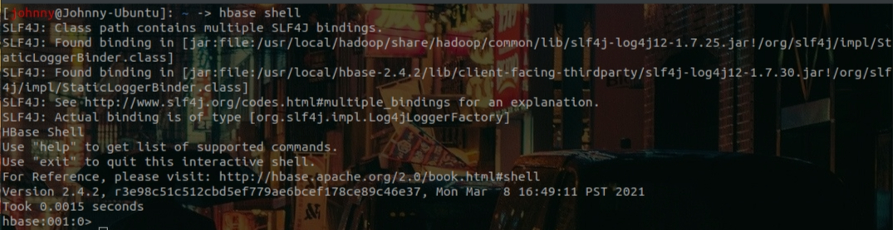
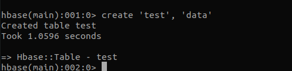
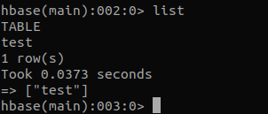
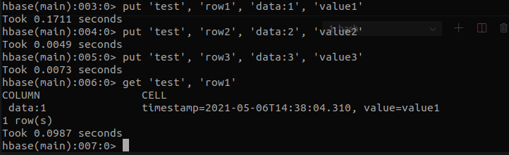
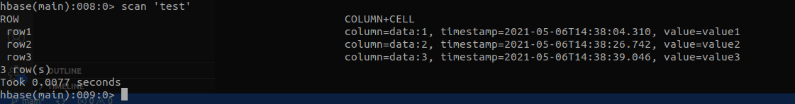
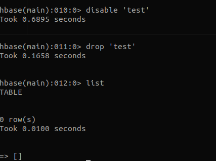

# 入門操作

<br>

---

<br>

進入 `/usr/local/hbase-x.y.z/bin` 目錄下輸入：

```bash
sudo ./start-hbase.sh
```

<br>

這個指令會啟動一個單機版 Hbase，預設 Hbase 會把資料寫入 `/tmp/hbase-${USERID}` 目錄中，我們可以透過修改 hbase-site.xml 的 `hbase.tmp.dir` 修改成另外的路徑。

<br>

啟動 Hbase shell 來管理 Hbase：

<br>

```bash
hbase shell
```

<br>



<br>

建立一個名為 `test` 的資料表，其中一個欄位家族名為 `data`並使用預設值當作資料表與欄家族屬性。

<br>



<br>

使用 `list` 指令可以查看用戶空間的資料表。

<br>



<br>

接下來新增 3 筆資料進入到 test 中。

```bash
put 'test', 'row1', 'data:1', 'value1'
put 'test', 'row2', 'data:2', 'value2'
put 'test', 'row3', 'data:3', 'value3'
```

並印出第一筆 `row1` 資料內容。

```bash
get 'test', 'row1'
```

<br>



<br>

使用 `scan` 命令可以查看整張 table 內容：

```bash
scan 'test'
```

<br>



<br>

若要移除 Table 的話要先停用它（`disable`）然後在刪掉它（`drop`）。

<br>

停用
```hbase
disable 'test'
```

刪除
```hbase
drop 'test'
```

