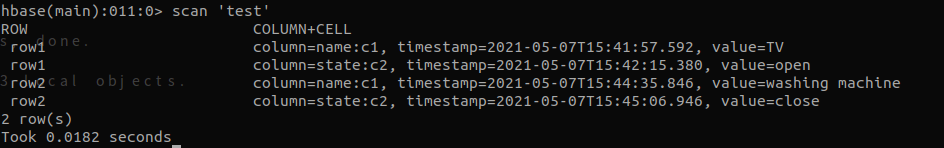

# hbase 資料結構介紹

<br>

---

<br>

HBase 的 Table 是由欄（column）與列 （row）組成的。

資料表的行鍵（row key）是位元陣列，因此理論上任何東西都可以當作 row key，而且 table 中的資料也是通過 row key 進行排序。

<br>

根據前一個章節，我們實做了的 Java API 時所 put 的資料，製作成表格大概長這個樣子：

<br>

|  | Column Family: __name__ | Column Family: __state__ |
| --- | --- | --- |
|  | `c1` | `c2` |
| row1|c1:電視 |c2: open|
|row2|c1:洗衣機|c2: close|

<br>

這邊根據這個表格具體解釋一下 HBase 資料結構。

<br>

首先在建立表格的時候，我們就要指定好 Column Family，也可以叫做  __欄家族__。我們指定了 name 與 state 這兩個欄家族。欄家族跟欄可不一樣，欄可以在表格建立好後動態增加，這就是跟一般 SQL 不一樣的地方，一般的 SQL 沒辦法動態新增欄位，HBase 卻可以。

`c1` 屬於 __name__ 家族，`c2` 屬於 __state__ 家族。當然，我們也可以隨時新增一個 `c3`，前提是要指定好這個欄位的 Coslumn Family。

<br>

建立以上 table 指令如下：

<br>

```bash
create 'test', 'name', 'state'
```
<br>

放入資料：

<br>

```bash
put 'test', 'name:c1', 'TV'
put 'test', 'state:c2', 'open'
put 'test', 'name:c1', 'washing machine'
put 'test', 'state:c2', 'close'
```
<br>

可以看到新增資料的欄位部份，格式為 ：`column-family:column-name`，如果想要的話，我們可以隨便添加任意 `column-name`，但是有一點一定要注意，就是 `column-family` 一定要事先就被建立好。

<br>

看看最終建立好的資料：

<br>



<br>


