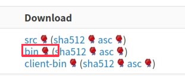
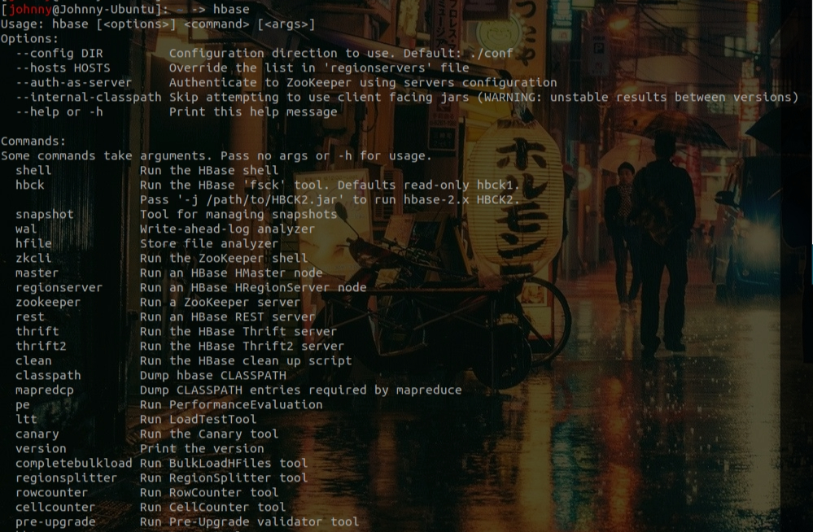

# Hbase 安裝

<br>

---

<br>

安裝 Hbase 首先要去 Apache 官方網站上下載，官方下載網址如下：

<br>

https://downloads.apache.org/hbase/stable/

<br>

最好不要直接下載最新版本，使用 stable 版本會比較沒有問題。記得是下載 bin 版本：

<br>



<br>

下載好後解壓縮檔案：

<br>

```sh
tar xzf hbase-x.y.z.tar.gz
```

<br>

然後把 hbase 資料夾移到 `/usr/local/` 目錄下，所以最後 hbase 落地位置是 `/usr/local/hbase-x.y.z`。

<br>

接下來編輯 hbase 中的 `/conf/hbase-env.sh`，加入一段 JAVA_HOME 路徑描述：

<br>

```sh
export JAVA_HOME=/usr/lib/jvm/java-1.8.0-openjdk-amd64
```

<br>

最後編輯 '~/.bashrc' 文件，加入 Hbase 環境變數：

<br>

```bash
# hbase config
export HBASE_HOME=/usr/local/hbase-2.3.5
export PATH=$PATH:$HBASE_HOME/bin
```

<br>

記得編輯好後要使用 `source .bashrc` 指令載入新的設定。

<br>

以上，我們就安裝好 hbase 了，可以使用 `hbase` 指令試試看：

<br>

```bash
hbase
```

<br>

