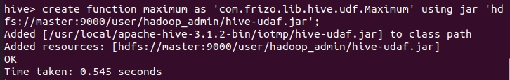

# Java UDAF(彙總函數)

<br>

---

<br>


UDAF (user-defined aggregate function)，他會比 UDF 難寫一點，需要處裡的東西更多。

UDF 只能對單一筆紀錄作運算，產生單一筆紀錄作為輸出，就是丟一筆資料進去，吐一個結果回來。

UDAF 可以對多筆紀錄作運算，並產生一筆紀錄作輸出，他有點像 `count()` `max()` 方法。

<br>

我們就來寫一個篩選最高氣溫的 UDAF 來試看看。

<br>

```java
import org.apache.hadoop.hive.ql.exec.UDAF;
import org.apache.hadoop.hive.ql.exec.UDAFEvaluator;
import org.apache.hadoop.io.IntWritable;

public class Maximum extends UDAF {

    public static class MaximumIntUDAFEvaluator implements UDAFEvaluator{

        private IntWritable result;

        @Override
        public void init() {
            result = null;
        }

        public boolean iterate(IntWritable value){
            if (value == null){
                return true;
            }

            if (result == null){
                result = new IntWritable(value.get());
            }else{
                result.set(Math.max(result.get(), value.get()));
            }
            return true;
        }

        public IntWritable terminatePartial() {
            return result;
        }

        public boolean merge(IntWritable other){
            return iterate(other);
        }

        public IntWritable terminate(){
            return result;
        }
    }
}
```

<br>

__UDAF 必須繼承自 `org.apache.hadoop.hive.ql.exec.UDAF`，並且要包含 1 個以上巢狀靜態類別實作自 `org.apache.hadoop.hive.ql.exec.UDAFEvaluator`__。

`UDAFEvaluator` 介面只有定義一個 `init()` 方法。

我們只寫了一個靜態巢狀類別 `MaximumIntUDAFEvaluator`，當然我們也可以寫出更多跟前面 UDF 可以定義很多 `evaluate()` 方法是一個道理，都是可以的。

<br>
<br>
<br>
<br>

每一個 `UDAFEvaluator` 巢狀靜態類別都需要實作以下 5 個方法：

<br>
<br>

### `init()`

初始化 Evaluator，重設內部狀態，一切需要初始化的工作都可以定義在這邊。

<br>
<br>

### `iterate()`

當有新的數值被匯總時，都會呼叫這個方法，並更新內部狀態。__`iterate()` 的參數設定也很重要，在 hive 呼叫 UDAF 時就是根據輸入的參數多寡與在這邊定義的參數匹配來選擇__。

<br>
<br>

### `terminatePartial()`

當 hive 需要一個區域會總結果時，就會呼叫 `terminatePartial()`。這個方法必須回傳一個物件來封藏匯總狀態。

<br>
<br>

### `merge()`

當 hive 決定合併兩個區域會總時，就會呼叫 `merge()`，這個方法需要一個物件當參數，參數型態必須與 `terminatePartial()` 回傳值型態相等。

<br>
<br>

### `terminate()`

需要最終匯總時，就會呼叫 `terminate()`，也就是最終結果。

<br>
<br>

寫好之後我們一樣打包 jar 上傳到 HDFS 中。這個範例中我的 jar 檔存放路徑為，上傳過程就跳過不演示了：

`hdfs://master:9000/user/hadoop_admin/hive-udaf.jar`

<br>

建立 function：

```sql
hive> create function maximum as 'com.frizo.lib.hive.udf.Maximum' using jar 'hdfs://master:9000/user/hadoop_admin/hive-udaf.jar';
```

<br>



<br>


先看一眼 records 的全部資料：

<br>

```sql
select * from records;
```

<br>


<br>

接下來套用 `maximum` 查詢最高溫。

<br>

```sql
select maximum(temperature) from records;
```

<br>


<br>

最終結果 111。(需要等待一段時間)