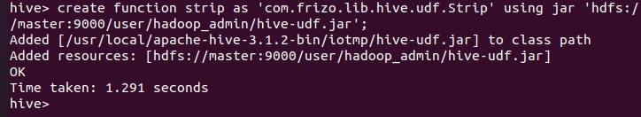

# Java UDF

<br>

---

<br>

當我們有一些複雜的查詢操作，無法使用 HiveQL 實現時，我們就可以使用 Java UDF，借助 Java 實現更加複雜的查詢功能。

<br>

首先來看一下 pom 依賴：

<br>

```xml
<dependency>
    <groupId>org.apache.hive</groupId>
    <artifactId>hive-exec</artifactId>
    <version>${hive-version}</version>
</dependency>

<dependency>
    <groupId>org.apache.hadoop</groupId>
    <artifactId>hadoop-client</artifactId>
    <version>${hadoop-version}</version>
</dependency>
```

<br>

根據自己的 hadoop 與 hive 版本來決定使用膽一版的 jar，基本上 jar 的版本是跟軟體走的。這邊我使用 hive-3.1.2 與 hadoop-3.3.0，跟自己主機上軟體版本保持一致。

<br>

接下來，我們編寫一段簡單的 Strip UDF。

<br>

```java
import org.apache.commons.lang.StringUtils;
import org.apache.hadoop.hive.ql.exec.UDF;
import org.apache.hadoop.io.Text;

public class Strip extends UDF {

    private Text result = new Text();

    public Text evaluate(Text text){
        if(text == null){
            return null;
        }
        result.set(StringUtils.strip(text.toString()));
        return result;
    }

    public Text evaluate(Text text, String stripChars){
        if (text == null){
            return null;
        }
        result.set(StringUtils.strip(text.toString(), stripChars));
        return result;
    }
}
```

<br>

寫 UDF 必須具備 2 個條件：

* 必須繼承自 `org.apache.hadoop.hive.ql.exec.UDF`

* 必須實作至少一個 `evaluate()` 方法。

<br>

evaluate() 並不是由一個介面或父類別定義的方法，它可以由我們自己定義任意數量參數，也可以回傳任意型態的值。hive 會根據我們在交互介面呼叫 UDF 的語法判斷要使用哪一組 `evaluate()`。

<br>

我們實作的 `Strip` 類別就定義了 2 個 `evaluate()` 方法，第一個單純就是去掉字串空白，第二個會將給出的 `stripChars` 從字尾刪除。

<br>

當我們寫完之後，請打包成 jar 檔，這邊我打包成 jar 檔，名為 `hive-udf.jar`，如果你使用的是單機 hive 的話，可以不用把 jar 檔丟到 HDFS 中，我這邊從部屬階段開始就已經是已叢集的方式架設的了，所以必須要把 jar 檔先上傳到 HDFS 上。

上傳前要先用 `chmod` 把 jar 檔所有權改為 hadoop 管理者。不然無法上傳。

<br>

```bash
hdfs dfs -copyFromLocal ~/hive-udf.jar hive-udf.jar
```

<br>

此時 hive-udf.jar 就已經被上傳到 `hdfs://master:9000/user/hadoop_admin/` 這個路徑下了。

開啟 hive 交互介面，我們繼續操作。

<br>


```sql
hive> create function strip as 'com.frizo.lib.hive.udf.Strip' using jar 'hdfs://master:9000/user/hadoop_admin/hive-udf.jar';
```

<br>



<br>

UDF 建立成功。讓我們試試看使用 UDF。

<br>

我們隨便找一個之前的 TABLE，就選 records 吧。

<br>

```sql
select strip('   bee ') from records;
```

<br>

```sql
select strip('abcabcabc', 'bc') from records;
```

<br>

