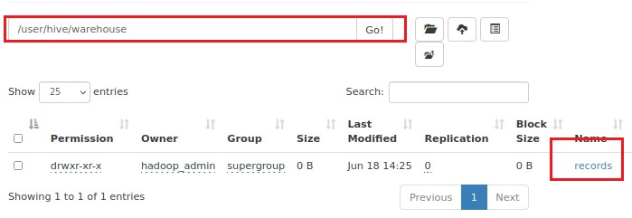
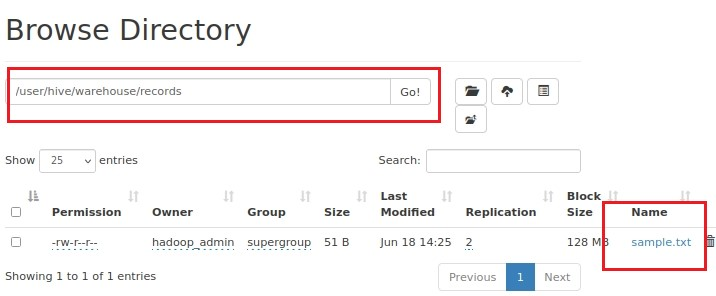
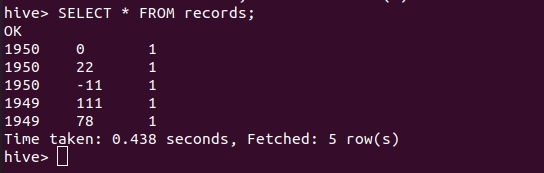
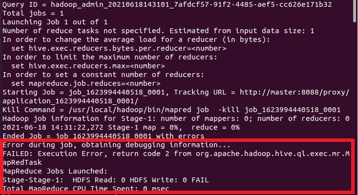
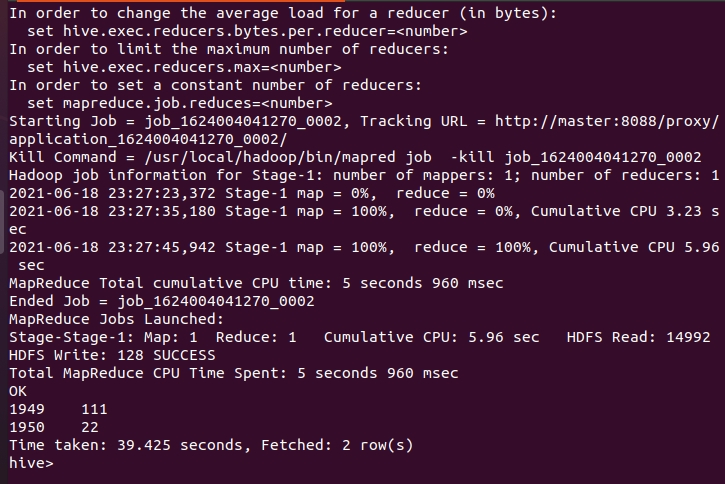

# Hive 基礎操作

<br>

----------------

<br>


## 建立 Table

<br>

進入到 hive 指令交互介面，并輸入以下指令，跟 SQL 很像：

<br>

```sql
hive> CREATE TABLE records (year STRING, temperature INT, quality INT) ROW FORMAT DELIMITED FIELDS TERMINATED BY '\t';
```

<br>

ROW FORMAT 子句資料檔案每一列文字是用 TAB (`'\t'`) 當作分隔符號，因為我們設定了三個欄位 `year`丶`temperature`丶`quality`。這樣一來，Hive 讀取檔案時預設每一列有三個欄位，分別對應我們定的 3 個欄位名稱。

<br>

實際上，當我們 CREATE TABLE 之後，這個名為 records 的 TABLE 會以一個資料夾的形式出現在 HDFS 中，路徑為 `/user/hive/warehouse/records`：

<br>



<br>

接下來，我們先來看一下範例測試文件，sample.txt

<br>

sample.txt：

```txt
1950	0	1
1950	22	1
1950	-11	1
1949	111	1
1949	78	1
```

<br>

可以很清楚的看見有三欄資料，`year`丶`temperature`丶`quality`。我們要使用 hive 來把這些資料讀入到 records Table 中。

輸入以下指令：

<br>

```sql
LOAD DATA LOCAL INPATH '/home/hadoop_admin/sample.txt' OVERWRITE INTO TABLE records;
```

<br>

執行以上命令之後，Hive 實際上把 sample.txt 上傳到 HDFS 中了，儲存位置就在 records 資料夾內。

<br>



<br>

現在我們可以執行以下 SQL 語句來做簡單查詢動作：

<br>

```sql
SELECT * FROM records;
```

<br>



<br>

接下來，我們來做複雜一點點的查詢，執行以下指令：

<br>

```sql
hive> SELECT year, MAX(temperature)
    > FROM records
    > WHERE temperature != 9999 AND quality IN (0, 1, 4, 5, 9)
    > GROUP BY year;
```

<br>

像這種複雜一點的查詢語句，hive 底層需要動用到 MapReduce，所以過程需要耗費一點時間。

<br>

如果使用 Hadoop 3.0.0 以上版本的話，執行以上語句或許會出現下面的錯誤：

<br>



<br>

我們在這邊 console 看不出甚麼問題，所以我們訪問 8088 port 檢查工作排程的 log，發現以下錯誤：

<br>

```log
Error: Could not find or load main class org.apache.hadoop.mapreduce.v2.app.MRAppMaster
Please check whether your etc/hadoop/mapred-site.xml contains the below configuration:

<property>
<name>yarn.app.mapreduce.am.env</name>
<value>HADOOP_MAPRED_HOME=${full path of your hadoop distribution directory}</value>
</property>
<property>
<name>mapreduce.map.env</name>
<value>HADOOP_MAPRED_HOME=${full path of your hadoop distribution directory}</value>
</property>
<property>
<name>mapreduce.reduce.env</name>
<value>HADOOP_MAPRED_HOME=${full path of your hadoop distribution directory}</value>
</property>
```

<br>

參考一篇文章後，得出問題與解決方案，文章如下：

https://mathsigit.github.io/blog_page/2017/11/16/hole-of-submitting-mr-of-hadoop300RC0/

<br>

hadoop 3.0.0 版本之後，各個 service 的環境變數已經不互相繼承，必須要經過 configuration 設定才行。所以我們需要修改 `$HADOOP_HOME/etc/hadoop/mapred-site.xml`，再原有的參數後加入新內容：

<br>

```xml
<configuration>

	<property>
	    <name>yarn.app.mapreduce.am.env</name>
	    <value>HADOOP_MAPRED_HOME=/usr/local/hadoop</value>
	</property>

	<property>
	    <name>mapreduce.map.env</name>
	    <value>HADOOP_MAPRED_HOME=/usr/local/hadoop</value>
	</property>

	<property>
	    <name>mapreduce.reduce.env</name>
	    <value>HADOOP_MAPRED_HOME=/usr/local/hadoop</value>
	</property>

</configuration>

```

<br>

__如果你跟我一樣用分布式 hadoop 的話，記得 slave 機器的 hadoop 也要套用一樣設定。__

<br>

設定好後，重啟 hadoop 服務，然後重新開啟 hive 指令互動介面，重新輸入查詢指令，這次應該就會式成功
回傳結果了，過程會比較久。

<br>



<br>

查詢成功。