## Hive 安裝

<br>

---

<br>

首先要想運行 hive，則當前主機必須是 hadoop 叢集之一，簡單說就是 hive 必須依賴 hadoop。所以在我們安裝 hive 之前，要先保證 hadoop 已被正確安裝並運行起來。

在我的主機上，負責管理 hadoop 系列服務的帳戶是 hadoop_admin，所以我也會把 hive 交給 hadoop_admin 管理，以下的設定操作也請切換到 hadoop 管理者帳戶進行。

<br>

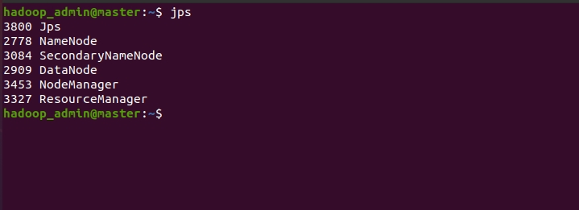

<br>
<br>
<br>
<br>

## 下載

<br>

現在我們就開始安裝 hive 吧，首先我們先找尋一下 hive 與 hadoop 的版本配對，這個在官方文件上就有附，以下是傳送門：

<br>

https://hive.apache.org/downloads.html

<br>

因為這台主機上安裝的是 hadoop 3.3.0，所以選擇 have-3.1.2 來匹配。

<br>

hive 下載網址 :

<br>

https://downloads.apache.org/hive/

<br>

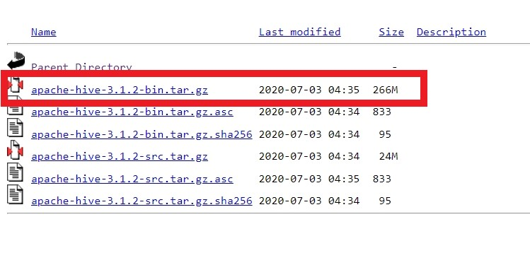

<br>

我們在 Ubuntu 上下載的話如果沒有 GUI 就使用 `wget` 指令來下載。

<br>

```bash
wget https://downloads.apache.org/hive/hive-3.1.2/apache-hive-3.1.2-bin.tar.gz
```

<br>

下載好後，就地解壓縮：

<br>

```bash
tar xzf apache-hive-3.1.2-bin.tar.gz
```

解壓縮之後，把 hive 目錄一道 `/usr/local` 下：

<br>

```bash
sudo mv apache-hive-3.1.2-bin /usr/local/
```

<br>

解壓完畢之後，要確認一下 hive 的歸屬。

<br>

```bash
cd /usr/local
ls -la
```

<br>

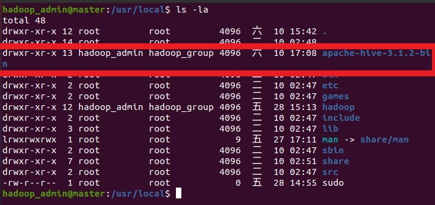

<br>

群組歸屬 hadoop_group，使用者歸屬 hadoop_admin。如果不是的話，請使用 `chown` 指令修改。

<br>
<br>
<br>
<br>

## 設定

<br>
<br>

### 編輯 `~/.bashrc`

<br>

加入以下設定：

<br>

```bash
# hive config
export HIVE_HOME=/usr/local/apache-hive-3.1.2-bin
export PATH=$PATH:$HIVE_HOME/bin
```

<br>

完成之後套用設定：

<br>

```bash
source ~/.bashrc
```

<br>
<br>

### 編輯 hive-config.sh

<br>

```bash
vim $HIVE_HOME/bin/hive-config.sh
```

<br> 

加入 hadoop_home 環境變數，hadoop 具體位置根據自己當前狀況調整：

<br>

```bash
export HADOOP_HOME=/usr/local/hadoop
```

<br>

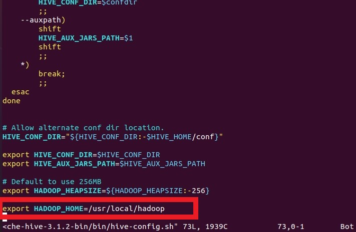

<br>
<br>

接下來，要去檢查 hadoop 與 hive 的 guava jar 檔版本是否一致，如果 Guava 版本不一致，在運行階段會出現以下錯誤：

<br>

```bash
“Exception in thread “main” java.lang.NoSuchMethodError: com.google.common.base.Preconditions.checkArgument(ZLjava/lang/String;Ljava/lang/Object;)V”
```

<br>

如果之後還是遇到這樣的訊息，那就回來檢查一下 Guava 版本。

hive jar 檔位置：`$HIVE_HOME/lib`

hadoop jar 檔位置： `$HADOOP_HOME/share/hadoop/hdfs/lib`

<br>

__Hive 與 Hadoop 使用到的 Guava 版本要以 Hadoop 使用的為主__，如果不一致，就把 hive 中的 Guava 刪掉換 Hadoop 中的 Guava（複製過去就可以了）。

<br>

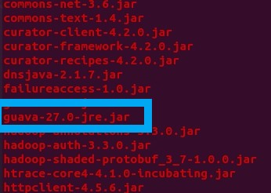

<br>
<br>

### 建立 hdfs 目錄

<br>

我們之後設定 metastore 會使用到 hdfs 中的目錄，所以我們先手動在 hdfs 上把需要的資料夾先建立出來。

<br>

```bash
hdfs dfs -mkdir /tmp
```

<br>

修改權限：

<br>

```bash
hdfs dfs -chmod 775 /tmp
```

<br>

使用 `hdfs dfs -ls /` 查看之後，應該要是如下：

<br>

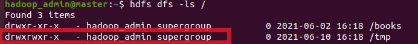

<br>

建立 warehouse 資料夾：

<br>

```bash
hdfs dfs -mkdir -p /user/hive/warehouse
```

<br>

修改權限：

<br>

```bash
hdfs dfs -chmod 775 /user/hive/warehouse
```

<br>

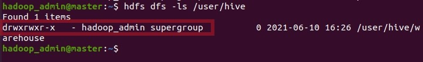

<br>
<br>

## 設定  hive-site.xml

<br>

hive-site.xml 設定內容非常多，所以 hive 有幫我們準備一個預設模板，我們只需要改我們需要的位置就好了，首先我們先把預設模板複製一份：

<br>

```bash
cd $HIVE_HOME/conf
cp hive-default.xml.template hive-site.xml
```

<br>

修改 hive-site.xml 內容：

<br>

```bash
vim hive-site.xml
```

<br>

首先我們需要確認一下 `hive.metastore.warehouse.dir` 屬性的值要跟上面在 hdfs 建立的 `/user/hive/warehouse` 一致。由於行數太多，我們使用 vim 搜尋關鍵字找到它：

<br>

```vim
:?hive.metastore.warehouse.dir
```

於是我們可以看到預設上其實就跟我門之前設定的一致了：

<br>

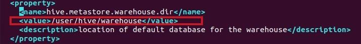

<br>

除此之外，我們還需要刪掉 hive 3.1.2 版的一個 bug，大約在 3215 行附近有一個 \<description\> 區塊，我們直接刪掉，因為這個敘述區塊有一個非法字元會造成讀取問題。

<br>

------------------

tips: vim 跳行方法就是直接輸入行數然後按住 shift + G。

------

<br>

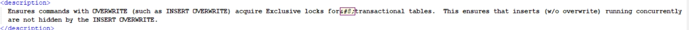

<br>

最後還需要添加一下 iotmp 資料夾，不然執行階段還是會出錯。

在 hive-site.xml 修改以下屬性，一樣使用搜尋關鍵字的方式搜尋 property 的 name：

<br>


```xml
<property>
    <name>hive.exec.local.scratchdir</name>
    <value>$HIVE_HOME/iotmp</value>
    <description>Local scratch space for Hive jobs</description>
</property>

<property>
    <name>hive.querylog.location</name>
    <value>$HIVE_HOME/iotmp</value>
    <description>Location of Hive run time structured log file</description>
 </property>

 <property>
    <name>hive.downloaded.resources.dir</name>
    <value>$HIVE_HOME/iotmp</value>
    <description>Temporary local directory for added resources in the remote file system.</description>
 </property>
```

<br>

修改好後，請在 `$HIVE_HOME` 下建立 /iotmp 資料夾：

<br>

```bash
mkdir $HIVE_HOME/iotmp
```

<br>

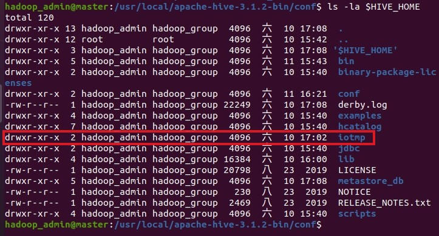

<br>
<br>
<br>
<br>

### 初始化 Derby Database


初始化 Derby Database 就是準備工作的最後一步了：

```bash
schematool -dbType derby -initSchema
```

<br>

稍待片刻，console 會印出很多空白段落，最後得出成功資訊。

<br>

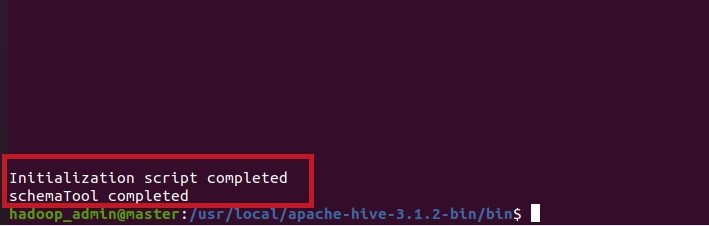

<br>
<br>

最後就來啟動 hive 試試看：

<br>

```bash
hive
```

<br>

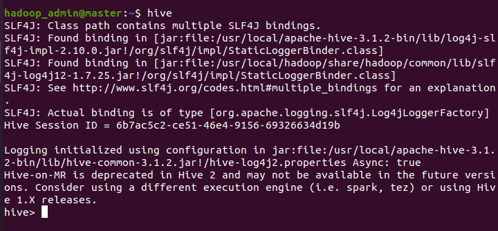

<br>

成功!


