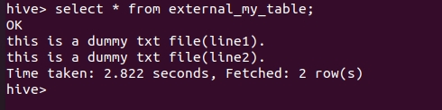

# Hive 管理內外部資料表

<br>

---------------

<br>

當你用 Hive 建立一個 Table 並把一個檔案交付給 Hive 管理時，可以有 2 種管理模式，一個是把這個 Table 當作 __內部資料表__ 處理，另一種則是當作 __外部資料表__。

先來說一下當做內部資料表的情形，假如我們在 HDFS 上有一個 data.txt 檔案，內容如下：

<br>

```txt
this is a dummy txt file(line1).
this is a dummy txt file(line2).
```

<br>

位置存放於 `hdfs://master:9000/user/hadoop_admin/data.txt`。

<br>

我們首先建立 __內部__ Table：

<br>

```sql
hive> CREATE TABLE my_table(dummy STRING);
```

<br>

建立 Table 預設就是以內部資料表的形式建立，所以不需要特別加指令。

<br>

接著我們把 data.txt 文件 LOAD 到 `my_table` 中。

<br>

```sql
hive> LOAD DATA INPATH '/user/hadoop_admin/data.txt' INTO TABLE my_table;
```

<br>

這樣一來，可以發現 Hive 直接把 data.txt 文件移動到 `/user/hive/warehouse/my_table` 中了，原本位置上的 data.txt 已經消失不見。當我們 DROP TABLE 時，data.txt 會隨著 my_table 的消失一起不見。


<br>

```sql
hive> DROP TABLE my_table;
```


<br>

內部資料表就代表說被 LOAD 的文件就跟 Hive 綁定了，全權交給 Hive 去管理。

<br>
<br>

外部資料表則不一樣。讓我們建立一個外部資料表試試：

<br>

```sql
hive> CREATE EXTERNAL TABLE external_my_table (dummy STRING) LOCATION '/user/hadoop_admin/external_my_table';
```

<br>

我們建立的外部 TABLE 跟建立內部 TABLE 相比多了一個 `EXTERNAL` 的宣告，並且使用 `LOCATION` 指定這張 TABLE 存在 `/user/hadoop_admin/external_my_table` 這個路徑中，注意這個路徑並不是預設的交由 hive 管理的路徑，而是一個不相干的路徑。

接下來我們 `LOAD` 一下資料，先前的 `/user/hadoop_admin/example.txt` 已經不付存在了，我們要先自己手動把資料添加進去。這邊就不演示了繼續執行 LOAD 動作。

<br>

```sql
hive> LOAD DATA INPATH '/user/hadoop_admin/data.txt' INTO TABLE external_my_table;
```

<br>

經過測試，可以看到這張 table 是可以正常查詢的。

<br>



<br>

使用 `EXTERNAL` 建立 TABLE，hive 就知道他不需要管理資料，所以它並不會把資料搬移進倉儲目錄中。當我們刪除掉這張 TABLE 時，外部資料將得到完完整保留，只有 TABLE 屬性北刪除而已。