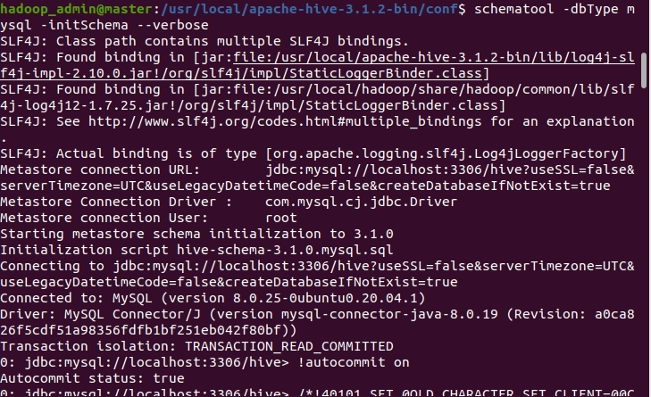
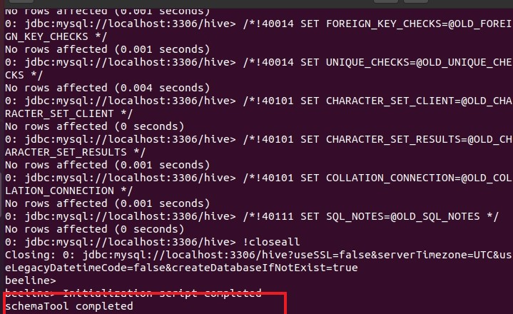
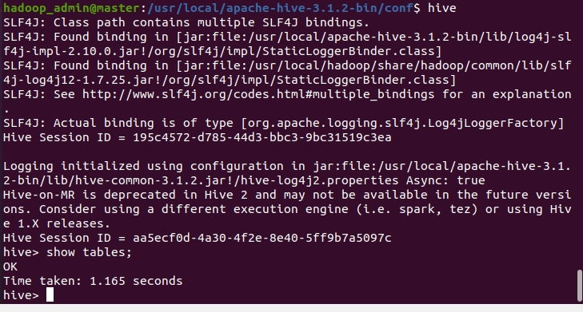

# Hive 使用 MySQL 作為 metastore

<br>    

--------------------------------

<br>

## 版本資訊

<br>

* 使用 OS： Ubuntu-20.04

* Hadoop 版本：3.3.0 

* Hive 版本：3.1.2

* JDK：1.8

* MySQL 版本：8.0.25

<br>
<br>
<br>
<br>

## MySQL 安裝

<br>

如果你的電腦上沒有 MySQL 請參照另一篇筆記 [點這裡](https://github.com/Johnny1110/Problem_Solving_Collection/blob/master/DB/MySQL_install/README.md) 先把 MySQL 安裝並調適好。

<br>
<br>
<br>
<br>


## 下載 MySQL JDBC jar

<br>

MySQL jar 檔下載：https://mvnrepository.com/artifact/mysql/mysql-connector-java

<br>

下載對應自己 MySQL 版本的 jar 檔就可以了，把下載好的 jar 檔放到以下目錄：

```bash
$HIVE_HOME/lib/
```

<br>
<br>
<br>
<br>

## 設定 Hive-site.xml

<br>

編輯 `$HIVE_HOME/conf/hive-site.xml`，善加利用 vim 的 `:?` 指令找尋關鍵屬性進行修改：

<br>

設定 JDBC 連線字串，在 MySQL 5 版以上，JDBC 連線字串就是這麼複雜的，要加 `useSSL`，`serverTimezone` 等等額外說明屬性。在 xml 中，`&` 符號是保留字，所以我們要手動把 `&` 改成命名實體 `&amp;`。具體細節參照以下文章：

[CSDN：XML中输入特殊符号 - GOon_star](https://blog.csdn.net/GOon_star/article/details/49636505)

<br>

```xml
<property>
    <name>javax.jdo.option.ConnectionURL</name>
    <value>jdbc:mysql://localhost:3306/hive?useSSL=false&amp;serverTimezone=UTC&amp;useLegacyDatetimeCode=false&amp;createDatabaseIfNotExist=true
    </value>
</property>
```

<br>

如果你在 mysql 中有設定主機名稱連線的話， `localhost 可以改成你自己的主機名稱。

<br>

設定 JDBC Driver Name：

```xml
<property>
    <name>javax.jdo.option.ConnectionDriverName</name>
    <value>com.mysql.cj.jdbc.Driver</value>
</property>
```

<br>

新版本的 JDBC Driver Name 是 `com.mysql.cj.jdbc.Driver`，舊版本的是 `com.mysql.jdbc.Driver`，如果你用的是舊版本 MySQL 的話，需要注意一下這邊 JDBC Driver Name。

<br>

設定 MySQL 登入帳密：

```xml
<property>
    <name>javax.jdo.option.ConnectionUserName</name>
    <value>root</value>
</property>

<property>
    <name>javax.jdo.option.ConnectionPassword</name>
    <value>password</value>
</property>
```

<br>

以上設定完成之後，執行以下命令初始化 metastore：

<br>

```bash
schematool -dbType mysql -initSchema --verbose
```

<br>





<br>

看到 schemaTool completed 就算成功了。

<br>

開啟 hive，輸入 `SHOW TABLES;` 測試能不能正常運行：

<br>



<br>

一切正常，完成!


