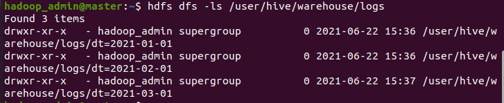

# Hive 分割區

<br>

---

<br>

分割區是一個很有趣的概念，它可以幫助我們把資料檔根據日期地區等訊息分類儲存在不同的資料夾中。這樣做的好處是當我們根據這些分類屬性查詢資料時可以更加精準有效率，它只需要掃描查詢指定的那個區塊就好，並不用全部都掃描。

<br>

以下提供書中涉及到的 6 個範例檔案，如果要跟著實作可以提前建立好檔案

<br>

* [partitions 測試資料](demo/partitions)

<br>

我們接下來將建立一張帶有分割區的 TABLE。

<br>

```sql
CREATE TABLE logs (ts BIGINT, line STRING) PARTITIONED BY (dt STRING, country STRING);
```

<br>

這邊注意到我們使用了 `PARTITIONED BY` 語法，我們建立 logs TABLE，使用 `dt`, 與 `country` 這兩個屬性來做分割。


我們來試試 LOAD file1，並對他進行切割資料指定。

<br>

```sql
LOAD DATA LOCAL INPATH 'input/hive/partitions/file1' INTO TABLE logs PARTITION (dt='2021-01-01', country='TW');
```

<br>


<br>

`dt` 與 `country` 並不是資料檔中的資料，而是我們在 `LOAD` 資料時自己附加進去當作 PARTITION 條件的，隨然不是實際資料中的一部分，看作成 logs TABLE 時，這些我們親手加入的 PARTITION 條件欄位就真的變成表中的資料了。

<br>


<br>

我們接下來把其他 5 個 file 一併加入進來吧。

<br>

```sql
LOAD DATA LOCAL INPATH 'input/hive/partitions/file2' INTO TABLE logs PARTITION (dt='2021-01-01', country='CN');

LOAD DATA LOCAL INPATH 'input/hive/partitions/file3' INTO TABLE logs PARTITION (dt='2021-02-01', country='TW');

LOAD DATA LOCAL INPATH 'input/hive/partitions/file4' INTO TABLE logs PARTITION (dt='2021-02-01', country='CN');

LOAD DATA LOCAL INPATH 'input/hive/partitions/file5' INTO TABLE logs PARTITION (dt='2021-03-01', country='TW');

LOAD DATA LOCAL INPATH 'input/hive/partitions/file6' INTO TABLE logs PARTITION (dt='2021-03-01', country='CN');
```

<br>

展開 TABLE 應該要像這樣。

<br>


<br>

我們可以隨便試試一些 SELECT 語法。

<br>

```sql
select * from logs where dt = '2021-03-01';
select * from logs where country = 'TW';
```

<br>

我們來看一下現在 HDFS 中 log 的檔案目錄結構

<br>



<br>


<br>

畫成樹狀圖：

<br>

```
/user/hive/warehouse/logs
    |
    |－－dt=2021-01-01
    |                |
    |                |－－country=TW
    |                           |
    |                           |－－file1
    |
    |－－dt=2021-01-01
    |                |
    |                |－－country=CN
    |                           |
    |                           |－－file2
    |－－dt=2021-02-01
    |                |
    |                |－－country=TW
    |                           |
    |                           |－－file3
    |－－dt=2021-02-01
    |                |
    |                |－－country=CN
    |                           |
    |                           |－－file4

        ......
```

這樣應該就很好裡接分割區的概念了。

<br>

當我們下達查詢指令例如：

<br>

```sql
select * from logs where dt='2021-01-01'
```

<br>

Hive 將只會掃描 logs 目錄下名為 `dt=2021-01-01` 目錄下的所有檔案。這無疑大大縮短了掃描時間。